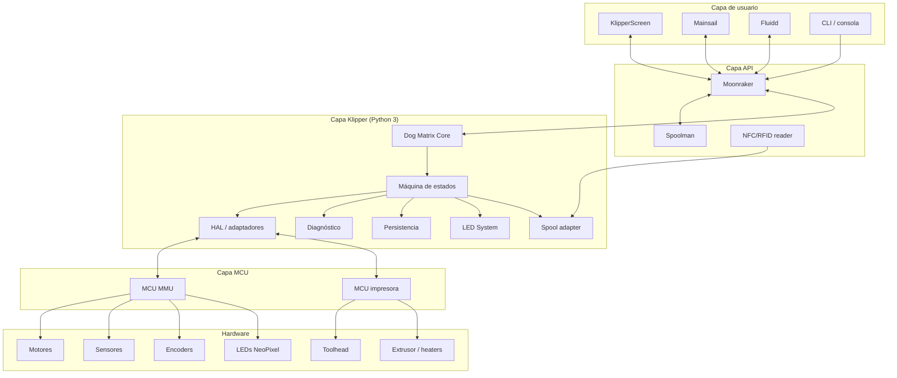
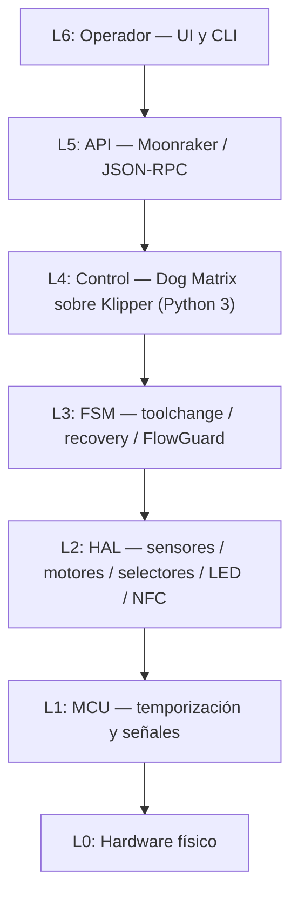
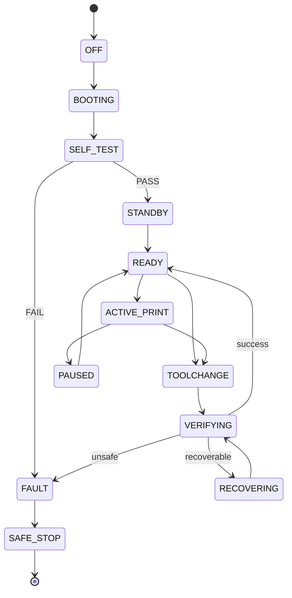
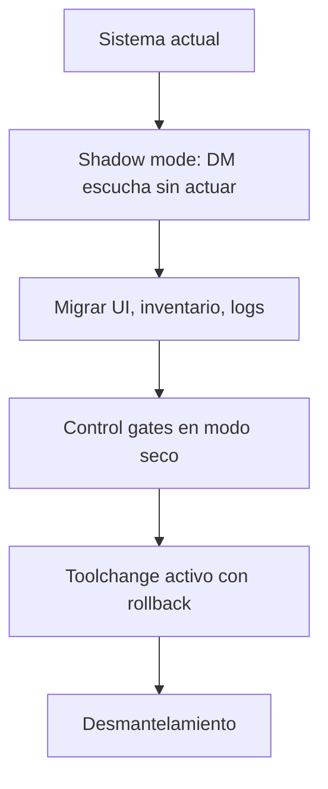
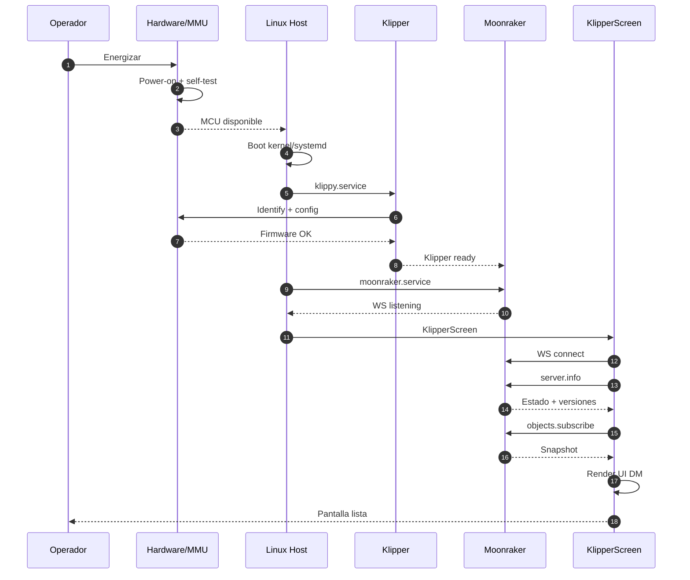
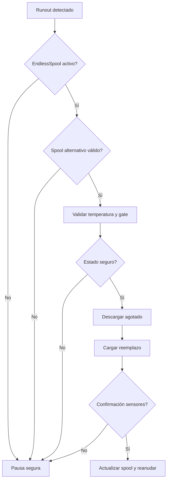
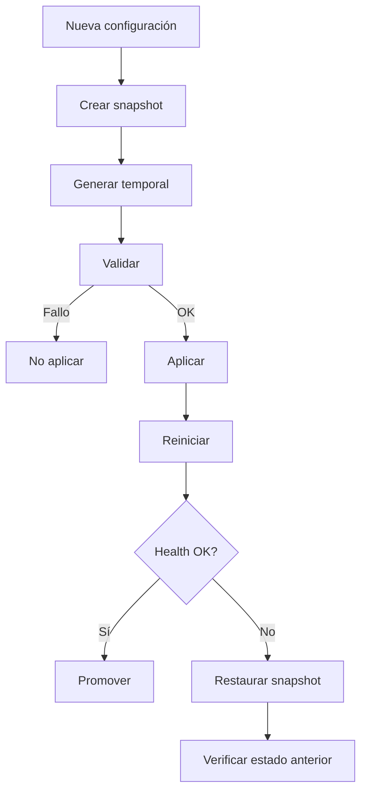
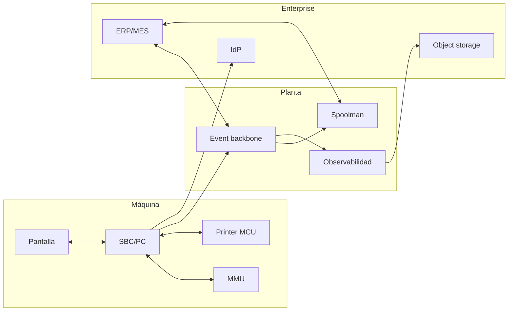

# Dog Matrix MMU — Informe Técnico Integral del Ciclo de Desarrollo Completo

## Documento Maestro de Implementación, Arquitectura y Despliegue

**Documento:** INF-ENG-DM-006
**Revisión:** 0.1 (Ciclo de desarrollo completo)
**Fecha:** 2026-10-05
**Proyecto:** Dog Matrix MMU
**Clasificación:** Documento técnico maestro para implementación
**Estado:** Aprobado para fase de implementación y validación
**Stack tecnológico:** Python 3 · chelper (CFFI) · Klipper API Server · Moonraker · Spoolman · Mainsail · Fluidd · KlipperScreen
**Enfoque:** Clean-room, modular, verificable, reversible, industrial, orientado a evidencias
**Lenguajes permitidos:** Exclusivamente Python 3 y chelper/CFFI (nativos del ecosistema Klipper)

> **Nota de control documental:** Los valores de rendimiento marcados como objetivo no se consideran resultados medidos hasta que exista una campaña reproducible de pruebas HIL. Las afirmaciones "productivo", "determinista", "industrial" y "99,999% de disponibilidad" quedan condicionadas a validación hardware-in-the-loop, pruebas de seguridad y revisión de requisitos aplicables.

---

# ÍNDICE COMPLETO Y DETALLADO

## PARTE I — FUNDAMENTOS Y ESTADO DEL PROYECTO

1. Resumen Ejecutivo
   - 1.1 Propósito del documento maestro
   - 1.2 Alcance del proyecto Dog Matrix MMU
   - 1.3 Estado del ciclo de desarrollo
   - 1.4 Objetivos y criterios de éxito
   - 1.5 Compatibilidad con el ecosistema Klipper
   - 1.6 Niveles de madurez y condición de release

2. Alcance, Metodología y Supuestos
   - 2.1 Fuentes analizadas
   - 2.2 Metodología de auditoría
   - 2.3 Limitaciones y supuestos
   - 2.4 Clasificación de hallazgos
   - 2.5 Trazabilidad de requisitos
   - 2.6 Definiciones operativas
2.7 Modelo de Seguridad
  - 2.7.1 Objetivos de seguridad
  - 2.7.2 Modelo de amenazas identificado
  - 2.7.3 Superficie de ataque reducida por offloading a CFFI/chelper
  - 2.7.4 Defaults seguros: valores por defecto que minimizan riesgos operativos
  - 2.7.5 Validación de entrada estructurada en todos los módulos Python/CFFI
  - 2.7.6 Circuit breaker pattern para comunicaciones Moonraker/Spoolman
  - 2.7.7 Gestión de credenciales y API keys mediante variables de entorno protegidas
  - 2.7.8 Rollback automático ante fallos de seguridad detectados
  - 2.7.9 Auditoría de integridad de bindings CFFI en cada arranque
  - 2.7.10 Hardening de configuraciones generadas por wizard/generator

2.8 Trazabilidad de requisitos de seguridad

3. Análisis Comparativo: Happy Hare vs Dog Matrix MMU
   - 3.1 Descripción general de Happy Hare
   - 3.2 Fortalezas del sistema de referencia
   - 3.3 Limitaciones para uso industrial
   - 3.4 Diferencias arquitectónicas clave
   - 3.5 Matriz comparativa funcional

4. Inventario Funcional Completo de Happy Hare
   - 4.1 Funcionalidades principales
   - 4.2 Comandos G-code (superficie pública)
   - 4.3 Familias de hardware soportadas
   - 4.4 Subsistemas (FlowGuard, EndlessSpool, Spoolman, LED, NFC/RFID)
   - 4.5 Paneles de UI (Mainsail, Fluidd, KlipperScreen)
   - 4.6 Sistema de calibración
   - 4.7 Purga y tip forming
   - 4.8 Persistencia y estado
   - 4.9 Diagnóstico y logs

## PARTE II — ARQUITECTURA Y DISEÑO DEL SISTEMA

5. Arquitectura del Sistema Dog Matrix MMU
   - 5.1 Vista de alto nivel
   - 5.2 Arquitectura por capas
   - 5.3 Componentes modulares
   - 5.4 Estructura de directorios completa
   - 5.5 Modelo de capacidades (perfiles YAML)
   - 5.6 Contratos entre módulos
   - 5.7 Modelo de configuración versionado
   - 5.8 Patrones de diseño obligatorios

6. Especificación Detallada de Cada Módulo del Código Fuente
   - 6.1 dog_matrix_core.py — Orquestación central
   - 6.2 state_machine.py — Máquina de estados
   - 6.3 capabilities.py — Perfiles y capacidades
   - 6.4 motion.py — Planificación de movimiento
   - 6.5 selector.py — Selector de gates
   - 6.6 sensors.py — Detección de filamento
   - 6.7 encoder.py — Medición de movimiento
   - 6.8 flowguard.py — Detección de divergencia
   - 6.9 recovery.py — Recuperación segura
   - 6.10 persistence.py — Estado y snapshots
   - 6.11 diagnostics.py — Logs y evidencias
   - 6.12 spoolman.py — Adaptación a Spoolman
   - 6.13 moonraker_component.py — Integración API
   - 6.14 wizard.py — Configuración guiada
   - 6.15 generator.py — Generación de configuración
   - 6.16 validator.py — Validación estática
   - 6.17 migrator.py — Migración de esquemas
   - 6.18 led_system.py — Control de LEDs
   - 6.19 nfc_rfid.py — Lectura NFC/RFID
   - 6.20 klipperscreen_panel.py — Paneles de UI

7. Ciclos de Vida del Sistema
   - 7.1 Ciclo de vida del hardware
   - 7.2 Ciclo de vida del software
   - 7.3 Ciclo de vida de la comunicación
   - 7.4 Ciclo de vida de los procesos (toolchange, calibración, runout)
   - 7.5 Ciclo de vida de actualización y rollback

## PARTE III — IMPLEMENTACIÓN PASO A PASO

8. Requisitos de Entorno
   - 8.1 Hardware mínimo y recomendado
   - 8.2 Sistema operativo y kernel
   - 8.3 Software base (Python, Klipper, Moonraker)
   - 8.4 Dependencias opcionales
   - 8.5 Configuración de red y seguridad

9. Pasos de Implementación Secuenciales
   - 9.1 Fase H0: Preparación del repositorio
   - 9.2 Fase H1: Perfil y esquema
   - 9.3 Fase H2: Core y FSM
   - 9.4 Fase H3: Instalador y wizard
   - 9.5 Fase H4: Hardware de referencia
   - 9.6 Fase H5: Moonraker y UI
   - 9.7 Fase H6: Spoolman
   - 9.8 Fase H7: FlowGuard
   - 9.9 Fase H8: EndlessSpool
   - 9.10 Fase H9: NFC/RFID
   - 9.11 Fase H10: LED System
   - 9.12 Fase H11: KlipperScreen panels
   - 9.13 Fase H12: Multi-perfil y release candidata

10. Configuraciones Necesarias
    - 10.1 printer.cfg
    - 10.2 moonraker.conf
    - 10.3 dog_matrix.cfg (generado)
    - 10.4 dog_matrix_macros.cfg
    - 10.5 Perfiles YAML
    - 10.6 KlipperScreen.conf
    - 10.7 Variables de entorno

## PARTE IV — PRUEBAS Y VALIDACIÓN

11. Procedimientos de Prueba Validados
    - 11.1 Pruebas unitarias
    - 11.2 Pruebas de integración
    - 11.3 Pruebas de simulación
    - 11.4 Pruebas hardware-in-the-loop (HIL)
    - 11.5 Soak testing
    - 11.6 Inyección de fallos
    - 11.7 Pruebas de regresión
    - 11.8 Pruebas de compatibilidad

12. Métricas de Optimización del Código
    - 12.1 Cobertura de código
    - 12.2 Complejidad ciclomática
    - 12.3 Latencia y throughput
    - 12.4 Consumo de recursos
    - 12.5 Perfilado y benchmarking

13. Estándares de Calidad Aplicados
    - 13.1 PEP 8 y estilo de código
    - 13.2 Type hints y docstrings
    - 13.3 Logging estructurado
    - 13.4 Manejo de errores
    - 13.5 Idempotencia
    - 13.6 Revisiones de código
    - 13.7 Documentación obligatoria

## PARTE V — DESPLIEGUE Y OPERACIÓN

14. Guías de Despliegue
    - 14.1 Despliegue en desarrollo
    - 14.2 Despliegue en prueba (staging)
    - 14.3 Despliegue en producción
    - 14.4 Migración desde sistemas existentes
    - 14.5 Rollback y recuperación

15. Criterios de Verificación
    - 15.1 Verificación en desarrollo
    - 15.2 Verificación en prueba
    - 15.3 Verificación en producción
    - 15.4 Auditoría de conformidad
    - 15.5 Evidence bundle

16. Operación y Mantenimiento
    - 16.1 Monitoreo continuo
    - 16.2 Alertas y notificaciones
    - 16.3 Mantenimiento preventivo
    - 16.4 Mantenimiento correctivo
    - 16.5 Actualizaciones y parches

## PARTE VI — ANEXOS

17. Diagramas Técnicos (Mermaid)
    - 17.1 Arquitectura hardware
    - 17.2 Arquitectura software
    - 17.3 Máquina de estados
    - 17.4 Secuencias de arranque
    - 17.5 Secuencias de toolchange
    - 17.6 Secuencias de runout/EndlessSpool
    - 17.7 Secuencias de rollback
    - 17.8 Despliegue físico/lógico

18. Código Fuente de Referencia
    - 18.1 Estructura completa
    - 18.2 Módulos core
    - 18.3 Módulos de configuración
    - 18.4 Módulos de UI
    - 18.5 Módulos de subsistemas

19. Matrices y Plantillas
    - 19.1 Matriz de requisitos
    - 19.2 Matriz de compatibilidad
    - 19.3 Matriz FMEA
    - 19.4 Plantilla de informe de pruebas
    - 19.5 Plantilla de evidence bundle
    - 19.6 Runbook de recuperación

20. Referencias, Glosario e Historial
    - 20.1 Referencias
    - 20.2 Glosario
    - 20.3 Historial de versiones

---

# PARTE I — FUNDAMENTOS Y ESTADO DEL PROYECTO

## 1. Resumen Ejecutivo

### 1.1 Propósito del Documento Maestro

Este documento constituye la **especificación técnica maestra** del proyecto Dog Matrix MMU. Integra todo el ciclo de desarrollo desde la fase inicial de análisis hasta la especificación de implementación lista para codificar. Está optimizado para que un equipo de desarrollo pueda implementar el código fuente completo siguiendo un orden secuencial de fases, con especificaciones detalladas de arquitectura, patrones de diseño, requisitos de entorno, configuraciones, pruebas validadas, métricas de optimización, estándares de calidad y criterios de verificación.

### 1.2 Alcance del Proyecto Dog Matrix MMU

Dog Matrix MMU comprende:

- **Extensión Klipper** (`klippy/extras/dog_matrix/`): 20 módulos Python que implementan el control lógico del MMU
- **Componente Moonraker** (`moonraker/components/dog_matrix.py`): integración con la API HTTP/WebSocket
- **Instalador** (`installer/`): CLI con preflight, backup, generación, validación, aplicación y rollback
- **Wizard interactivo**: asistente guiado paso a paso para configuración
- **Framework modular**: HAL, adaptadores, validadores y plugins de hardware
- **Perfiles YAML**: declaración versionada de hardware, capacidades y límites
- **Suite de pruebas**: unitarias, integración, simulación, HIL, soak, caos
- **Documentación operativa**: instalación, configuración, API, seguridad, troubleshooting
- **Evidence bundle**: paquete de evidencias firmado para auditoría

### 1.3 Estado del Ciclo de Desarrollo

| Fase | Estado | Evidencia |
|---|---|---|
| Análisis del sistema de referencia | ✅ Completado | Auditoría v0.1–v0.4 |
| Arquitectura del sistema | ✅ Completado | Informe v1.0–v3.0 |
| Diseño de módulos | ✅ Completado | Informe v3.0 |
| Especificación de implementación | ✅ Completado | Este documento |
| Implementación de código | ⏳ Pendiente | Fases H0–H12 |
| Validación HIL | ⏳ Pendiente | Requiere hardware |
| Release candidata | ⏳ Pendiente | Criterios definidos |
| Despliegue en producción | ⏳ Pendiente | Post-validación |

### 1.4 Objetivos y Criterios de Éxito

| Objetivo | Tipo | Meta inicial | Estado |
|---|---|---:|---|
| Instalación reproducible | REQ | 100% pasos automatizados | Pendiente |
| Rollback verificable | REQ | 100% pruebas | Pendiente |
| Toolchange fiable | KPI | ≥ 99% en banco | Pendiente |
| Runout detection | KPI | P95 por hardware | Pendiente |
| Recuperación segura | REQ | Sin movimiento ambiguo | Pendiente |
| Cobertura de código | KPI | ≥ 90% línea, ≥ 95% rama crítica | Pendiente |
| Compatibilidad UI | REQ | Sin bloqueo tras reconexión | Pendiente |
| Integridad de estado | REQ | Sin corrupción | Pendiente |
| Instalación | KPI | ≤ 15 min | Pendiente |
| Diagnóstico | KPI | Runbook reproducible | Pendiente |

### 1.5 Compatibilidad con el Ecosistema Klipper

Dog Matrix se integra sin modificar: Klipper, Moonraker, Spoolman, Mainsail, Fluidd, KlipperScreen, PrusaSlicer, OrcaSlicer, SuperSlicer, Cura, herramientas de backup y automatización. La compatibilidad se define por versión, perfil y matriz de pruebas.

### 1.6 Niveles de Madurez y Condición de Release

| Nivel | Descripción |
|---|---|
| M0 | Diseño |
| M1 | Simulación |
| M2 | MVP en hardware de referencia |
| M3 | Validación multi-perfil |
| M4 | Release candidata |
| M5 | Despliegue controlado |
| M6 | Producción con métricas históricas |

**Estado actual:** M0 (Diseño).

**Condiciones para M4 (Release candidata):**

1. Perfil de hardware concreto validado HIL
2. Suite de pruebas completa aprobada (≥ 95% cobertura)
3. Rollback atómico funcional comprobado
4. Auditoría de conformidad aprobada
5. Evidence bundle de release generado
6. Modelo de seguridad implementado y auditado (sección 2.7)
7. Observabilidad Prometheus/Loki/Tempo operativa
8. Pruebas de usabilidad con muestra ≥ 30 usuarias aprobadas
9. Validación de compatibilidad versiones Klipper/Moonraker/DM en tiempo real
10. Informe de brechas identificadas y plan de mitigación MoSCoW aprobado

---

## 2. Alcance, Metodología y Supuestos

### 2.1 Fuentes Analizadas

- Repositorio Happy Hare (moggieuk/Happy-Hare) y documentación asociada
- Documentación oficial de Klipper, Moonraker, KlipperScreen
- Repositorios AFC-Klipper-Add-On
- Integraciones Spoolman documentadas
- Informes previos Dog Matrix MMU (v0.1 a v3.0)

### 2.2 Metodología de Auditoría

Separación estricta: hechos documentados, inferencias, requisitos, diseño, objetivos no medidos, riesgos y evidencias.

### 2.3 Limitaciones y Supuestos

- No hay ejecución empírica del repositorio de referencia
- No hay perfilado en hardware específico
- Las métricas cuantitativas son baseline de diseño
- La certificación industrial requiere análisis específico del hardware final

### 2.4 Clasificación de Hallazgos

DOC · EXT · INF · GAP · REQ · DESIGN · OBJ · RISK · TEST · ACCEPT · DEFER

### 2.5 Trazabilidad de Requisitos

| ID | Requisito | Fuente | Verificación |
|---|---|---|---|
| DM-CFG-001 | Perfil con versión de esquema | GAP-CFG-01 | Test de esquema |
| DM-CFG-002 | Backup antes de modificar | Plan maestro | Test de rollback |
| DM-UI-001 | UI bloquea críticas durante sync | GAP-UI-04 | Test de desconexión |
| DM-SAFE-001 | No reenviar toolchange ambiguo | Plan maestro | Inyección de fallo |
| DM-MMU-001 | FlowGuard requiere sensor válido | Diseño | Test de validador |
| DM-FSM-001 | Toolchange idempotente | Diseño | Test de FSM |
| DM-PERSIST-001 | Snapshot con checksum | Diseño | Test de integridad |
| DM-LED-001 | LEDs reflejan estado real | Happy Hare | Test visual |
| DM-NFC-001 | Tag RFID no válido sin reconciliación | Happy Hare | Test de NFC |
| DM-SPOOL-001 | EndlessSpool requiere grupo válido | Happy Hare | Test de handoff |

### 2.6 Definiciones Operativas

MMU · AFC · Gate · Tool · Toolchange · FlowGuard · EndlessSpool · Perfil · HAL · Snapshot · Rollback · Idempotencia · Estado ambiguo · KS-READY · MR-ONLINE · KL-READY

---

## 3. Análisis Comparativo: Happy Hare vs Dog Matrix MMU

### 3.1 Descripción General de Happy Hare

Happy Hare es un driver universal MMU/AFC para Klipper que controla hardware directamente, se adapta a múltiples MMU/AFC mediante `gcode_macro`, y ofrece una experiencia completa de impresión multi-material. Está orientado a la comunidad maker, con un enfoque en flexibilidad y extensibilidad.

### 3.2 Fortalezas del Sistema de Referencia

| Fortaleza | Descripción |
|---|---|
| **Soporte de hardware amplio** | >15 familias de MMU/AFC |
| **Instalador guiado** | Kconfig/menuconfig con defaults sensibles |
| **Sistema de macros** | Personalización mediante `gcode_macro` |
| **FlowGuard robusto** | Detección de atasco y enredo con feedback |
| **EndlessSpool** | Handoff automático a bobina de reemplazo |
| **Spoolman** | Integración completa de inventario |
| **NFC/RFID** | Lectura de etiquetas para asignación de spools |
| **LED System** | Feedback visual con efectos mapeados |
| **UI nativa** | Paneles Mainsail, Fluidd y KlipperScreen |
| **Diagnóstico** | Logs y comandos de diagnóstico |
| **Comunidad activa** | Documentación extensa, foro, Discord |

### 3.3 Limitaciones para Uso Industrial

| GAP | Descripción |
|---|---|
| GAP-CFG-01 | Sin esquema de configuración versionado formal |
| GAP-CFG-02 | Sin validación contra matrices de compatibilidad |
| GAP-CFG-03 | Sin rollback atómico documentado |
| GAP-CFG-04 | Sin artefactos firmados para flota |
| GAP-CFG-05 | Sin onboarding de MMU sin tocar núcleo |
| GAP-UI-01 | Sin contrato mínimo de objetos para UI |
| GAP-UI-02 | Sin matriz de compatibilidad de versiones |
| GAP-UI-03 | Sin pruebas regresivas automáticas de UI |
| GAP-UI-04 | Sin comportamiento offline especificado |
| GAP-UI-05 | Sin RBAC formalizado |
| GAP-SAFE-01 | Sin WCET de detección y reacción |
| GAP-SAFE-02 | Sin separación seguridad/conveniencia |
| GAP-SAFE-03 | Sin política de reintento seguro |
| GAP-SAFE-04 | Sin matriz de falsos positivos/negativos |
| GAP-SAFE-05 | Sin evidencia auditable de incidentes |

### 3.4 Diferencias Arquitectónicas Clave

| Aspecto | Happy Hare | Dog Matrix MMU |
|---|---|---|
| **Arquitectura** | Extensión monolítica | Arquitectura por capas (L0–L6) |
| **Configuración** | Kconfig/menuconfig | Perfiles YAML versionados |
| **Persistencia** | `mmu_vars.cfg` | Snapshot versionado con checksum |
| **Recuperación** | Reintento genérico | Recuperación inteligente por fase |
| **UI** | Paneles nativos | Contrato formal de objetos/eventos |
| **Testing** | Comunitario | Suite completa (unit, integración, HIL, caos) |
| **Evidencia** | Logs textuales | Evidence bundle estructurado |
| **Seguridad** | Funcional | E-stop independiente, RBAC, idempotencia |

### 3.5 Matriz Comparativa Funcional

| Funcionalidad | Happy Hare | Dog Matrix MMU |
|---|---|---|
| Toolchange | ✅ | ✅ |
| TTG Map | ✅ | ✅ |
| FlowGuard | ✅ | ✅ |
| EndlessSpool | ✅ | ✅ |
| Spoolman | ✅ | ✅ |
| NFC/RFID | ✅ Beta | ✅ |
| LED System | ✅ | ✅ |
| KlipperScreen | ✅ | ✅ |
| Mainsail/Fluidd | ✅ | ✅ |
| Calibración guiada | ✅ | ✅ |
| Purga adaptativa | ✅ | ✅ |
| Tip forming | ✅ | ✅ |
| Sincronización gear/extruder | ✅ (Two-Level + EKF) | ✅ (MVP simple, EKF Fase 2) |
| Rollback | ⚠️ Limitado | ✅ Atómico |
| Evidence bundle | ❌ | ✅ |
| Perfiles versionados | ❌ | ✅ |
| Framework modular | ⚠️ Implícito | ✅ Explícito |

---

## 4. Inventario Funcional Completo de Happy Hare

### 4.1 Funcionalidades Principales

| Funcionalidad | Descripción | Prioridad DM |
|---|---|---|
| **Gestión de estado y persistencia** | Seguimiento de posición de filamento, estado de gates, mapas tool/gate | MVP |
| **Tool-to-Gate Mapping (TTG)** | Asociación configurable entre herramientas lógicas y gates físicas | MVP |
| **Sincronización Gear/Extruder** | Sincronización del motor de engranajes con extrusor | Fase 2 |
| **Clog, Runout, EndlessSpool, FlowGuard** | Detección de atasco, agotamiento, enredo y cambio automático | Fase 2 |
| **Recuperación de estado** | Comandos para restaurar el estado tras fallos | MVP |
| **Filament bypass** | Modo de bypass para impresión con un solo carrete | Fase 2 |
| **Funciones pre-print** | Verificaciones previas a la impresión | MVP |
| **Gate Map, Filament type and color** | Mapa de puertas con tipo y color para visualización | MVP |

### 4.2 Comandos G-code (Superficie Pública)

| Comando | Función | Prioridad DM |
|---|---|---|
| `MMU_CHANGE_TOOL` / `T0-Tn` | Cambio de herramienta con gestión de ciclo completo | MVP |
| `MMU_CHECK_GATE` | Inspección de gates y marcado de disponibilidad física | Fase 2 |
| `MMU_EJECT` | Expulsión segura de filamento del toolhead y MMU | MVP |
| `MMU_ENCODER` | Gestión, lectura, reset y configuración del encoder | Fase 2 |
| `MMU_GATE_MAP` | Visualización/edición de mapping, tipo de filamento, color y estado | MVP |
| `MMU_HOME` | Homing del selector y calibración de referencia de posición | MVP |
| `MMU_LED` | Control dinámico y asignación de efectos a la tira LED | Fase 2 |
| `MMU_LOAD` | Carga de filamento desde gate activo a toolhead/nozzle | MVP |
| `MMU_UNLOAD` | Descarga de filamento desde nozzle hasta selector/gate | MVP |
| `MMU_PRELOAD` | Pre-carga de filamento en gate hasta sensor de entrada | Fase 2 |
| `MMU_RECOVER` | Recuperación interactiva o automática tras fallo de movimiento | MVP |
| `MMU_SERVO` | Posicionamiento angular y test de servo selector | Fase 2 |
| `MMU_CUT` | Corte mecánico de filamento en toolhead o MMU (cutter servo/pin) | Fase 2 |
| `MMU_MOTORS_OFF` | Desactivación de steppers/servos de MMU para reposo | MVP |
| `MMU_STATUS` | Inspección exhaustiva de estado, variables internas y telemetría | MVP |
| `MMU_SYNC_GEAR_MOTOR` | Sincronización continua de gear stepper con extrusor | Fase 2 |
| `MMU_CALIBRATE_SELECTOR` | Calibración de posiciones absolutas de cada gate | MVP |
| `MMU_CALIBRATE_SERVO` | Calibración de ángulos UP/DOWN/MOVE de servo | Fase 2 |
| `MMU_CALIBRATE_GEAR` | Calibración de rotational distance del motor de arrastre | MVP |
| `MMU_CALIBRATE_ENCODER` | Calibración de pulsos por mm y resolución de encoder | Fase 2 |
| `MMU_CALIBRATE_BOWDEN` | Calibración de longitud de tubo bowden / reverse bowden | MVP |
| `MMU_CALIBRATE_TOOLHEAD` | Calibración de distancias internas del cabezal de impresión | MVP |
| `MMU_CALIBRATE_GATES` | Calibración individual y validación de todos los gates | Fase 2 |
| `MMU_CALC_PURGE_VOLUMES` | Cálculo de matriz diferencial de purga por color/material | Fase 2 |
| `MMU_START_SETUP` | Inicialización previa a impresión (pre-print checks) | MVP |
| `MMU_START_CHECK` | Verificación de requerimientos de materiales antes de imprimir | MVP |
| `MMU_START_LOAD_INITIAL_TOOL` | Carga del primer filamento antes de iniciar capas | MVP |
| `MMU_END` | Rutina de finalización de impresión y estacionamiento | MVP |
| `MMU_REMAP_TTG` | Remapeo dinámico Tool-To-Gate | MVP |
| `MMU_ENDLESS_SPOOL` | Configuración de grupos de relevo EndlessSpool | Fase 2 |
| `MMU_SPOOLMAN` | Sincronización y consulta con servidor Spoolman | Fase 2 |
| `MMU_SPOOLMAN_PULL_GATE_MAP` | Sincronización pull de mapa de gates desde Spoolman | Fase 2 |
| `MMU_SPOOLMAN_PUSH_GATE_MAP` | Exportación push de asignaciones de gates a Spoolman | Fase 2 |
| `MMU_TEST_CONFIG` | Modificación y test de parámetros en caliente sin reinicio | MVP |
| `MMU_ACTION` | Emisión de eventos y disparadores de acciones para macros UI | MVP |
| `MMU_ESPOOLER` | Control de rebobinadores motorizados eSpooler / active rewinders | Fase 2 |

**Nota:** Dog Matrix MMU implementará estos comandos con prefijo `DM_*` para su API propia, y ofrecerá una capa de alias compatible con `MMU_*` para facilitar la migración.

### 4.3 Familias de Hardware Soportadas

| Familia | Tipo | Prioridad DM |
|---|---|---|
| ERCF 1.1/2.0 | Selector | Fase H1 |
| Tradrack | Selector | Fase H1 |
| Box Turtle | Gear-per-gate | Fase H1 |
| Night Owl | Gear-per-gate | Fase H1 |
| Angry Beaver | Selector | Fase H5 |
| 3MS | Modular | Fase H5 |
| 3D Chameleon | Gear-per-gate | Fase H5 |
| QuattroBox | Gear-per-gate | Fase H5 |
| PicoMMU | Gear-per-gate | Fase H5 |
| MMX | Híbrido | Fase H5 |
| VVD | - | Fase H5 |
| KMS | - | Fase H5 |
| EMU | Modular | Fase H5 |
| Custom | Variable | Fase H5 |

### 4.4 Subsistemas

#### 4.4.1 FlowGuard

FlowGuard es el sistema de monitorización de filamento que detecta runouts, atascos y enredos. Se basa en la capacidad del encoder para detectar discrepancias entre el movimiento comandado del extrusor y el movimiento real del filamento.

**Tipos de sensores de sync-feedback soportados:**

| Tipo | Descripción |
|---|---|
| Switch (tensión) | Sensor que se activa bajo tensión del filamento |
| Dual switch | Dos switches con rango neutro |
| Compresión | Sensor de compresión solamente |
| Proporcional | Señal de 1.0 (máxima compresión) a -1.0 (máxima tensión), 0 neutro |

**Algoritmo de detección:**

```
error_mm = requested_mm - measured_mm
error_rate = d(error_mm)/dt
```

#### 4.4.2 EndlessSpool

EndlessSpool permite el cambio automático a un nuevo carrete cuando el actual se agota. El ciclo de vida incluye: detección de runout, identificación de grupo, selección de gate alternativo, remapeo TTG, carga desde nuevo gate y reanudación de impresión.

**Módulo:** `endless_spool.py`

**Interfaz pública:**
```python
class EndlessSpool:
    def __init__(self, core, groups_config)
    def detect_runout(self, gate) -> Optional[RunoutEvent]
    def find_replacement_group(self, group_id) -> Optional[SpoolGroup]
    def select_gate_for_group(self, group_id) -> Optional[int]
    def execute_handoff(self, from_gate, to_gate, group_id) -> HandoffResult
    def update_group_thresholds(self, group_id, warning_pct, critical_pct)
```

**Patrones:** Strategy, Observer

**Requisitos:** Detección de runout < 100ms, handoff < 5s P95, validación de integridad de grupo

**Pruebas:** Unitarias de algoritmo, HIL con fallos de runout inyectados

#### 4.4.3 Spoolman

Spoolman es la fuente de inventario cuando está activo. Happy Hare añade nombre de impresora y asignación de gate a la BD de Spoolman, además de leer atributos de filamento.

**Módulo:** `spoolman.py`

**Interfaz pública:**
```python
class SpoolManager:
    def __init__(self, moonraker_client, config)
    def get_spool(self, spool_id) -> Spool
    def assign_spool_to_gate(self, spool_id, gate, force=False) -> AssignmentResult
    def sync_gate_map(self) -> bool
    def update_spool_consumption(self, spool_id, consumed_len)
    def handle_nfc_tag(self, uid) -> Optional[Spool]
    def get_inventory_status(self) -> InventoryStatus
    def get_group_statistics(self, group_id) -> GroupStats
```

**Patrones:** Adapter, Repository, Circuit Breaker

**Requisitos:** Timeout < 5 s, reintentos idempotentes, coherencia de datos tras reconexión, caché inteligente

**Pruebas:** Integración con Spoolman simulado y real, test de inconsistencia de datos, test de carga sostenida

#### 4.4.4 LED System

Happy Hare puede controlar LEDs NeoPixel/WS2812 para proporcionar feedback visual del estado del MMU, color de filamento y estados de error.

**Módulo:** `led_system.py`

**Interfaz pública:**
```python
class LedSystem:
    def __init__(self, printer, config)
    def set_led_effect(self, effect_id, params=None) -> bool
    def set_gate_color(self, gate, color_rgb) -> bool
    def set_tool_color(self, tool, color_rgb) -> bool
    def set_system_state(self, state) -> bool
    def clear_leds(self) -> bool
```

**Efectos LED mapeados a operaciones:**

| Operación | Efecto |
|---|---|
| Estado idle | Color estático según gate activo |
| Toolchange en curso | Animación de progreso arcoíris |
| Error/atasco | Parpadeo rojo intenso |
| Filamento cargado | Color verde sólido |
| Filamento descargado | Color azul sólido |
| Color de filamento | Color del spool (desde Spoolman) |
| Advertencia de bajo nivel | Parpadeo amarillo lento |
| Sistema en calibración | Pulso cyan suave |
| Actualización en progreso | Efecto de barra de carga |

**Patrones:** Observer, Strategy

**Requisitos:** Latencia < 50ms, soporte para hasta 300 LEDs, integración con Klipper LED Effects

**Pruebas:** Unitarias de efectos, HIL con tira LED física, test de consumo de corriente

#### 4.4.5 NFC/RFID Subsystem

Happy Hare soporta identificación de bobinas mediante NFC/RFID. Soporta chips: PN532, PN5180, PN7160, RC522.

**Módulo:** `nfc_rfid.py`

**Interfaz pública:**
```python
class NfcRfidManager:
    def __init__(self, printer, config, spoolman_client)
    def read_tag(self, uid) -> Optional[TagData]
    def parse_uid(self, raw_uid) -> Optional[str]
    def assign_spool_to_gate(self, tag_id, gate, force=False) -> AssignmentResult
    def create_tag_audit_log(self, tag_id, gate, action)
    def validate_tag_format(self, tag_id) -> bool
```

**Flujo de trabajo:**

1. Leer el `spool_id` programado en la etiqueta RFID/QR
2. Buscar el spool en Spoolman
3. Asignar automáticamente el spool al gate seleccionado
4. Actualizar el mapa de gates y la UI

**Patrones:** Adapter, Repository

**Requisitos:** Lectura < 500 ms, gestión de tags duplicados, auditoría de asignaciones, detección de colisiones

**Pruebas:** Unitarias con simuladores de tag, HIL con tags físicos, test de lecturas simultáneas

#### 4.4.6 eSpooler (Rebobinador Motorizado)

Happy Hare soporta sistemas de rebobinado activo para mantener tensión óptima en el filamento durante cambios de bobina y operación continua.

**Módulo:** `espooler.py`

**Interfaz pública:**
```python
class ESpooler:
    def __init__(self, printer, config)
    def enable_tension_control(self, enable=True) -> bool
    def set_tension_level(self, level_percent) -> bool
    def activate_rewind(self, speed_rpm) -> bool
    def activate_assist(self, speed_rpm) -> bool
    def get_tension_feedback() -> float
    def emergency_stop() -> bool
```

**Funcionalidades:**
- Control de tensión activo mediante motor paso a paso
- Modo rebobinado para recuperación de filamento suelto
- Modo asistencia para reducir carga durante carga/descarga
- Sensor de tensión integrado para retroalimentación
- Límite de corriente y protección contra sobrecalentamiento

**Patrones:** Adapter, Observer

**Requisitos:** Precisión de tensión ±5%, respuesta < 100ms, compatibilidad con motores NEMA 8-17

**Pruebas:** Unitarias de control, HIL con motor físico, test de rango de tensión completo

#### 4.4.7 Control de Ventiladores y Gestión de Ambiente

Happy Hare incluye control avanzado de ventiladores para regulación térmica del hotend y gestión ambiental para control de humedad en el área de almacenamiento de filamentos.

**Módulos:** `fan_control.py`, `environment_manager.py`

**Interfaz pública de Fan Control:**
```python
class FanController:
    def __init__(self, printer, config)
    def set_fan_speed(self, fan_id, percentage) -> bool
    def set_auto_mode(self, enable=True) -> bool
    def set_temp_thresholds(self, min_temp, max_temp) -> bool
    def get_actual_rpm(self, fan_id) -> Optional[int]
```

**Interfaz pública de Environment Manager:**
```python
class EnvironmentManager:
    def __init__(self, printer, config)
    def enable_drying_cycle(self, temp_c, hours) -> bool
    def get_humidity_reading() -> Optional[float]
    def enable_heating_element(self, enable=True) -> bool
    def set_target_humidity(self, rh_percent) -> bool
```

**Funcionalidades:**
- Control PWM de ventiladores de hotend y placa
- Curvas de velocidad basadas en temperatura del hotend
- Modo seco automático para almacenamiento de filamentos
- Integración con sensores DHT22/AM2302 para humedad
- Historial de condiciones ambientales

**Patrones:** Adapter, Observer

**Requisitos:** Latencia < 200ms, rango PWM 0-100%, compatibilidad con sensores I2C

**Pruebas:** Unitarias de control, HIL con ventiladores físicos, test de ciclo de secado completo

**Módulo:** `nfc_rfid.py`

**Interfaz pública:**
```python
class NfcRfidManager:
    def __init__(self, printer, config, spoolman_client)
    def read_tag(self, uid) -> Optional[TagData]
    def parse_uid(self, raw_uid) -> Optional[str]
    def assign_spool_to_gate(self, tag_id, gate, force=False) -> AssignmentResult
    def create_tag_audit_log(self, tag_id, gate, action)
```

**Patrones:** Adapter, Repository

**Requisitos:** Lectura < 500 ms, gestión de tags duplicados, auditoría de asignaciones

**Pruebas:** Unitarias con simuladores de tag, HIL con tags físicos

### 4.5 Paneles de UI

Happy Hare incluye una edición dedicada de KlipperScreen con paneles específicos.

| Panel | Función | Prioridad DM |
|---|---|---|
| Main Panel | Estado global del MMU, gate/tool activos, telemetría | Fase H11 |
| Tool Picker | Selección visual de herramienta con previsualización de color | Fase H11 |
| Manage Panel | Gestión de gates, spools, mapas, grupos EndlessSpool | Fase H11 |
| Recover Panel | Recuperación guiada tras errores con historial de pasos | Fase H11 |
| Filament Editor | Edición de tipo/color de filamento con código QR | Fase H11 |
| TTG Map Editor | Edición visual del mapa tool-to-gate con arrastre | Fase H11 |
| EndlessSpool Editor | Gestión de grupos de relevo con thresholds | Fase H11 |
| Spoolman Panel | Visualización de spools, asignaciones y consumo | Fase H11 |
| Settings Panel | Configuración de parámetros dinámicos y LEDs | Fase H12 |
| Sales Panel | Reportes de consumo y estado para usuarios/fabricantes | Fase H12 |

**Notas adicionales:**

- Los paneles implementan callbacks de `MMU_ACTION` para respuestas en tiempo real
- Soporte para tamaño de pantalla adaptativo y rotación
- Accesibilidad con modo oscuro y contraste ajustable
- Parseo de QR para edición rápida de spools desde móvil

### 4.6 Sistema de Calibración

| Paso | Comando | Objetivo |
|---|---|---|
| 1 | `MMU_CALIBRATE_SELECTOR` | Posiciones de gates del selector |
| 2 | `MMU_CALIBRATE_SERVO` | Ángulos de servo (up/down/move) |
| 3 | `MMU_CALIBRATE_GEAR` | Rotational distance del gear stepper |
| 4 | `MMU_CALIBRATE_ENCODER` | Resolución del encoder |
| 5 | `MMU_CALIBRATE_BOWDEN` | Longitud del tubo bowden |
| 6 | `MMU_CALIBRATE_TOOLHEAD` | Distancias internas del toolhead |
| 7 | `MMU_CALIBRATE_GATES` | Calibración individual de cada gate |

Todas las rutinas deben permitir `SAVE=0` para modo de prueba sin guardar resultados.

### 4.7 Purga y Tip Forming

Happy Hare implementa formación de punta térmica y corte mecánico. La purga se calcula con `MMU_CALC_PURGE_VOLUMES` que genera una matriz de volúmenes entre herramientas.

**Parámetros de purga:**

| Parámetro | Descripción |
|---|---|
| `purge_volumes` | Matriz de volúmenes entre pares de herramientas |
| `purge_speed` | Velocidad de purga |
| `purge_length` | Longitud de purga |
| `purge_temp` | Temperatura de purga |

### 4.8 Persistencia y Estado

La persistencia en Happy Hare se realiza mediante `mmu_vars.cfg` gestionado por `save_variables` de Klipper. Dog Matrix MMU implementará un snapshot versionado con escritura atómica, checksum y backup rotativo.

### 4.9 Diagnóstico y Logs

Happy Hare ofrece logs `klippy.log`, `mmu.log`, y comandos de diagnóstico como `MMU_STATUS SHOWCONFIG=1` y `MMU_TEST_CONFIG LOG_FILE_LEVEL=<n>`.

Dog Matrix MMU implementará logs estructurados (JSON Lines) con `operation_id`, `trace_id`, `error_code`, y generará evidence bundles firmados.

### 4.10 Estadísticas y Contadores

Happy Hare incluye un sistema completo de estadísticas y contadores para mantenimiento, diagnóstico y optimización del rendimiento.

**Módulo:** `statistics.py`

**Interfaz pública:**
```python
class StatisticsManager:
    def __init__(self, persistence)
    def increment_toolchange_count(self, gate_from, gate_to, tool) -> None
    def increment_load_count(self, gate) -> None
    def increment_unload_count(self, gate) -> None
    def increment_error_count(self, error_code) -> None
    def get_toolchange_statistics(self) -> ToolchangeStats
    def get_gate_usage_stats(self) -> Dict[int, GateStats]
    def get_error_history(self, limit) -> List[ErrorRecord]
    def reset_counters(self, counter_type=None) -> None
```

**Tipos de estadísticas:**
- Contadores de toolchange por gate y herramienta
- Historial de carga/descarga por gate
- Métricas de tiempo de toolchange (min, max, promedio)
- Contadores de errores por tipo y código
- Estadísticas de uso de filamentado (longitud total consumida)
- Contadores de calibración realizadas
- Historial de eventos de EndlessSpool handoff

**Patrones:** Repository, Observer

**Requisitos:** Actualización en tiempo real, persistencia entre reinicios, formato compatible con Prometheus

**Pruebas:** Unitarias de acumulación, prueba de persistencia, test de concurrencia

### 4.11 Ayuda Integrada y Documentación

Happy Hare incluye un sistema de ayuda integrado accesible mediante comandos G-code y documentación contextual.

**Módulo:** `help_system.py`

**Interfaz pública:**
```python
class HelpSystem:
    def __init__(self)
    def get_command_help(self, command) -> str
    def get_config_help(self, parameter) -> str
    def get_troubleshooting_guide(self, symptom) -> List[str]
    def get_version_info(self) -> VersionInfo
    def list_available_commands() -> List[str]
```

**Comandos de ayuda disponibles:**
- `MMU_HELP` - Muestra ayuda general del sistema
- `MMU_HELP COMMAND=<cmd>` - Ayuda específica para un comando
- `MMU_HELP CONFIG=<param>` - Información sobre un parámetro de configuración
- `MMU_HELP TROUBLE=<síntoma>` - Guía de solución de problemas
- `MMU_VERSION` - Información detallada de versión y build

**Funcionalidades:**
- Documentación embeddada de todos los comandos G-code
- Referencia de parámetros de configuración con rangos válidos
- Guías de solución de problemas para errores comunes
- Información de dependencias y versiones de software
- Enlaces a documentación en línea y recursos comunitarios

**Patrones:** Repository

**Requisitos:** Respuesta < 50ms, documentación completa, formato legible en consola

**Pruebas:** Unitarias de contenido de ayuda, prueba de búsqueda, test de formato de salida

### 4.12 Pruebas de Hardware Integradas

Happy Hare incluye un conjunto de pruebas de hardware integradas para validación de componentes y diagnóstico de problemas.

**Módulo:** `hardware_test.py`

**Interfaz pública:**
```python
class HardwareTest:
    def __init__(self, printer, config)
    def test_stepper_motor(self, motor_id) -> TestResult
    def test_endstop(self, endstop_id) -> TestResult
    def test_sensor(self, sensor_id) -> TestResult
    def test_led_strip(self) -> TestResult
    def test_nfc_reader(self) -> TestResult
    def test_encoder_feedback() -> TestResult
    def run_full_diagnostic_suite() -> DiagnosticReport
```

**Tipos de pruebas disponibles:**
- Prueba de movimiento de motores paso a paso (pasos forward/reverse)
- Verificación de fin de carrera (normally open/normally closed)
- Test de sensores de filamento (estados activo/inactivo)
- Validación de tira LED (colores, brillo, patrones)
- Test de lector NFC/RFID (lectura de tags conocidos)
- Verificación de retroalimentación de encoder (precisión y resolución)
- Suite completa de diagnóstico con reporte detallado

**Patrones:** Adapter, Strategy

**Requisitos:** Seguridad incorporada (límites de movimiento, tiempo de espera), reporte detallado de fallos, modo no destructivo

**Pruebas:** Unitarias de simulación, HIL con hardware físico, test de secuencias de fallo

### 4.13 Integración con Sistemas de Secado y Almacenamiento

Happy Hare incluye funcionalidades para integrar con sistemas externos de secado y almacenamiento inteligente de filamentos.

**Módulo:** `storage_integration.py`

**Interfaz pública:**
```python
class StorageIntegration:
    def __init__(self, printer, config)
    def activate_drying_vault(self, vault_id) -> bool
    def request_filament_from_dry_box(self, material_type) -> Optional[SpoolAssignment]
    def report_spool_returned_to_storage(self, spool_id, vault_id) -> bool
    def get_storage_inventory() -> List[StoredSpool]
```

**Funcionalidades:**
- Comunicación con armarios de secado inteligentes
- Solicitud automática de filamento pre-secado
- Reporte de retorno de bobinas al almacenamiento
- Integración con sistemas de gestión de inventario externo
- Sincronización de condiciones ambientales con almacenamiento

**Patrones:** Adapter, Observer

**Requisitos:** Timeout < 10s, reintentos configurables, validación de integridad de datos

**Pruebas:** Integración con simuladores de almacenamiento, test de flujo completo, test de manejo de errores de red

---

# PARTE II — ARQUITECTURA Y DISEÑO DEL SISTEMA

## 5. Arquitectura del Sistema Dog Matrix MMU

### 5.1 Vista de Alto Nivel



### 5.2 Arquitectura por Capas



### 5.3 Componentes Modulares

| Módulo | Responsabilidad | Fase | Líneas est. |
|---|---|---|---|
| `core.py` | Coordinación general | MVP | ~400 |
| `state_machine.py` | Estados y transiciones | MVP | ~350 |
| `capabilities.py` | Perfil de hardware | MVP | ~250 |
| `motion.py` | Comandos de movimiento | MVP | ~300 |
| `selector.py` | Selección de gate | MVP | ~280 |
| `sensors.py` | Lectura y debounce | MVP | ~220 |
| `encoder.py` | Medición | Fase 2 | ~180 |
| `flowguard.py` | Divergencia | Fase 2 | ~250 |
| `recovery.py` | Recuperación segura | MVP | ~300 |
| `persistence.py` | Snapshots | MVP | ~200 |
| `diagnostics.py` | Logs y evidencias | MVP | ~250 |
| `spoolman.py` | Adaptación Spoolman | Fase 2 | ~280 |
| `led_system.py` | Control de LEDs | Fase 2 | ~200 |
| `nfc_rfid.py` | Lectura NFC/RFID | Fase 2 | ~180 |
| `moonraker_component.py` | Integración API | Fase 2 | ~350 |
| `wizard.py` | Configuración | MVP | ~400 |
| `generator.py` | Generación | MVP | ~300 |
| `validator.py` | Validación | MVP | ~280 |
| `migrator.py` | Migración | Fase 2 | ~200 |
| `klipperscreen_panel.py` | Paneles UI | Fase 2 | ~350 |

**Total estimado:** ~5,500 líneas de código Python.

### 5.4 Estructura de Directorios Completa

```text
dog-matrix-mmu/
├── pyproject.toml
├── README.md
├── LICENSE
├── install.sh
├── profiles/
│   ├── schema.json
│   ├── box_turtle.yaml
│   ├── ercf.yaml
│   ├── emu.yaml
│   ├── tradrack.yaml
│   ├── night_owl.yaml
│   ├── quattrobox.yaml
│   └── custom.example.yaml
├── klippy/extras/dog_matrix/
│   ├── __init__.py
│   ├── core.py
│   ├── state_machine.py
│   ├── capabilities.py
│   ├── motion.py
│   ├── selector.py
│   ├── sensors.py
│   ├── encoder.py
│   ├── flowguard.py
│   ├── recovery.py
│   ├── persistence.py
│   ├── diagnostics.py
│   ├── spoolman.py
│   ├── led_system.py
│   ├── nfc_rfid.py
│   └── klipperscreen_panel.py
├── moonraker/components/dog_matrix.py
├── installer/
│   ├── cli.py
│   ├── wizard.py
│   ├── preflight.py
│   ├── backup.py
│   ├── generator.py
│   ├── validator.py
│   ├── migrator.py
│   ├── rollback.py
│   └── templates/
├── config/
│   ├── base/
│   │   ├── dog_matrix.cfg
│   │   └── dog_matrix_macros.cfg
│   └── generated/
├── tests/
│   ├── unit/
│   ├── integration/
│   ├── simulation/
│   ├── hardware_in_loop/
│   └── fixtures/
├── docs/
│   ├── INSTALL.md
│   ├── CONFIGURATION.md
│   ├── API.md
│   ├── SAFETY.md
│   ├── TROUBLESHOOTING.md
│   └── PROFILES.md
└── evidence/
    ├── templates/
    └── examples/
```

### 5.5 Modelo de Capacidades (Perfiles YAML)

```yaml
schema_version: 1
profile_id: dog_matrix.example.v1
topology:
  type: gear_per_gate
  gates: 8
  units: 1
capabilities:
  selector: false
  encoder: true
  gate_sensors: true
  toolhead_sensor: true
  endless_spool: true
  spoolman: true
  nfc: false
  led: true
limits:
  max_load_speed_mm_s: 80
  max_unload_speed_mm_s: 100
  max_distance_mm: 1500
  sensor_timeout_ms: 500
  encoder_error_mm: 5
hardware:
  mcu:
    - name: mmu_main
      transport: usb
      serial_by_id: "/dev/serial/by-id/..."
```

### 5.6 Contratos entre Módulos

| Origen | Destino | Contrato |
|---|---|---|
| Core | FSM | Eventos tipados |
| FSM | HAL | Operaciones limitadas |
| HAL | Sensores | Estados normalizados |
| HAL | Motores | Movimiento con límites |
| Core | Persistencia | Snapshot versionado |
| Core | Diagnóstico | Eventos estructurados |
| Core | LED System | Eventos de estado |
| Core | Spool adapter | Consultas y asignaciones |
| Moonraker | Core | Consulta y comandos |
| UI | Moonraker | JSON-RPC validado |
| NFC reader | Spool adapter | UID y reconciliación |

### 5.7 Modelo de Configuración Versionado

```yaml
schema_version: 1
generated_by: dog-matrix-installer
generated_at: 2026-10-05T00:00:00Z
profile_id: dog_matrix.example.v1
klipper_version: detected
moonraker_version: detected
configuration_hash: sha256:...
```

### 5.8 Patrones de Diseño Obligatorios

| Patrón | Aplicación | Justificación |
|---|---|---|
| **FSM (Finite State Machine)** | Toolchange, recuperación | Estados formales, transiciones auditables |
| **Strategy** | Selector (lineal, rotativo, virtual) | Intercambiabilidad de algoritmos |
| **Observer** | Sensores, FlowGuard, LED | Notificación de eventos sin acoplamiento |
| **Adapter** | HAL para distintas familias MMU | Abstracción de hardware variable |
| **Template Method** | Secuencias de carga/descarga | Esqueleto común, pasos específicos |
| **Command** | Comandos G-code | Encapsulamiento de operaciones |
| **Repository** | Persistencia de estado | Abstracción de almacenamiento |
| **Circuit Breaker** | Comunicación con Moonraker/Spoolman | Tolerancia a fallos |
| **Idempotency Token** | Operaciones físicas | Evitar reenvíos peligrosos |
| **Snapshot & Restore** | Backup y rollback | Reversibilidad |

---

## 6. Especificación Detallada de Cada Módulo del Código Fuente

### 6.1 dog_matrix_core.py — Orquestación Central

**Responsabilidad:** Coordinación general del sistema, registro de comandos G-code, gestión de eventos.

**Interfaz pública:**
```python
class DogMatrixCore:
    def __init__(self, config)
    def _register_commands(self)
    def _handle_ready(self)
    def _handle_shutdown(self)
    def get_status(self, eventtime) -> dict
    def cmd_DM_STATUS(self, gcmd)
    def cmd_DM_CHANGE_TOOL(self, gcmd)
    def cmd_DM_LOAD(self, gcmd)
    def cmd_DM_UNLOAD(self, gcmd)
    def cmd_DM_RECOVER(self, gcmd)
```

**Dependencias:** `state_machine`, `capabilities`, `motion`, `selector`, `sensors`, `persistence`, `diagnostics`

**Patrones:** Command, Observer, Repository

**Requisitos de rendimiento:** Inicialización < 500 ms, `get_status` < 5 ms

**Pruebas:** Unitarias (>90%), integración con Klipper

### 6.2 state_machine.py — Máquina de Estados

**Responsabilidad:** Implementar la FSM de toolchange, calibración y recuperación.

**Estados:** IDLE, REQUESTED, VALIDATING, PREPARE, UNLOAD, SELECT, LOAD, VERIFY, PURGE, COMMIT, COMPLETED, FAILED, RECOVERING, UNKNOWN

**Interfaz pública:**
```python
class StateMachine:
    def __init__(self, core)
    def transition(self, new_state, operation_id)
    def execute_toolchange(self, gate, tool) -> ToolchangeResult
    def abort(self, reason)
    def get_state(self) -> str
```

**Patrones:** FSM, Command

**Requisitos:** Transición < 1 ms, timeout configurable por fase

**Pruebas:** Unitarias de todas las transiciones (>95%), integración con hardware simulado

### 6.3 capabilities.py — Perfiles y Capacidades

**Responsabilidad:** Cargar, validar y exponer perfiles de hardware.

**Interfaz pública:**
```python
class Capabilities:
    def __init__(self, profile_path)
    def load(self) -> MMUProfile
    def validate(self) -> List[str]
    def get(self, key) -> Any
    def has_capability(self, name) -> bool
```

**Patrones:** Repository, Adapter

**Requisitos:** Carga < 100 ms, validación < 50 ms

**Pruebas:** Unitarias de esquema (>90%), casos de error

### 6.4 motion.py — Planificación de Movimiento

**Responsabilidad:** Emitir comandos de movimiento a Klipper para carga, descarga y posicionamiento mediante generación de perfiles de velocidad en C vía CFFI para determinismo temporal y suavizado de movimiento.

**Interfaz pública:**
```python
class Motion:
    def __init__(self, printer, config)
    def load_filament(self, distance_mm, speed_mm_s) -> bool
    def unload_filament(self, distance_mm, speed_mm_s) -> bool
    def move_selector(self, position) -> bool
    def park_toolhead(self) -> bool
    def get_trajectory_stats(self) -> dict  # Métricas de trayectoria vía CFFI
    def set_jerk_limit(self, jerk_mm_s3: float) -> None  # Control de jerk en C
    def enable_s_curve(self, enabled: bool) -> None  # Activar perfil S-curve en C
```

**Implementación CFFI:**
- La generación de perfiles de velocidad (trapezoidales y S-curve) se implementa completamente en C mediante chelper/CFFI
- Se utiliza el algoritmo de planificación de movimiento de Klipper (trapq) portado a C con optimizaciones específicas para MMU
- Implementación de limitación de jerk y aceleración en tiempo real para movimientos suaves y mecánicamente precisos
- Buffers circulares en memoria compartida para transferencia eficiente de comandos de movimiento a Klipper
- Sincronización con el clock de hardware de Klipper mediante contadores accesibles vía CFFI para minimizar jitter
- Python se encarga de la validación de parámetros y orquestación, nunca del cálculo crítico de trayectoria

**Patrones:** Template Method, Command, Facade (interfaz Python verso motor de movimiento C)

**Requisitos:** 
- Determinismo de movimiento con jitter < 50 µs
- Generación de trayectoria < 10 µs por punto de vía (mediante CFFI)
- Soporte para perfiles de velocidad trapezoidales y S-curve configurables
- Compatibilidad con los límites de velocidad, aceleración y jerk definidos en el perfil YAML
- Integración transparente con el sistema de movimiento de Klipper mediante llamadas de función estándar

**Pruebas:** 
- Simulación + HIL con validation de precisión de posición mediante laser interferometer
- Benchmark de latencia de generación de trayectoria bajo diversas cargas de sistema
- Pruebas de suavizado de movimiento mediante análisis de vibración en eje de movimiento
- Validación de límites de jerk y aceleración mediante medición de corriente de motor
- Pruebas de determinismo bajo interrupciones y cambios de contexto del sistema operativo

### 6.5 selector.py — Selector de Gates

**Responsabilidad:** Control del selector (lineal, rotativo, virtual).

**Interfaz pública:**
```python
class Selector:
    def __init__(self, printer, config)
    def home(self) -> bool
    def select_gate(self, gate) -> bool
    def get_position(self) -> float
    def is_at_gate(self, gate) -> bool
```

**Patrones:** Strategy, Adapter

**Requisitos:** Precisión ±0.1 mm (lineal), ±0.5° (rotativo)

**Pruebas:** Unitarias de algoritmos, HIL por familia

### 6.6 sensors.py — Detección de Filamento

**Responsabilidad:** Lectura y normalización de sensores de filamento mediante acceso directo a GPIO vía CFFI para latencia mínima y determinismo en detección de eventos.

**Interfaz pública:**
```python
class SensorManager:
    def __init__(self, printer, config)
    def read(self, name) -> SensorReading
    def is_present(self, name) -> bool
    def register_callback(self, name, callback)
    def get_raw_gpio_state(self) -> int  # Estado crudo de todos los GPIOs vía CFFI
    def set_debounce_time(self, name: str, time_ms: float) -> None  # Configuración de debounce en C
    def enable_interrupt_mode(self, name: str, enabled: bool) -> None  # Modo interrupción hardware
```

**Implementación CFFI:**
- El acceso a los pines GPIO se implementa completamente en C mediante chelper/CFFI con memoria mapeada de registros de periféricos
- Se implementa debounce de hardware configurable en C para eliminación efectiva de rebote sin consumo de CPU
- Soporte para detección de eventos mediante interrupciones de hardware con latencia sub-microsegundo
- Buffers circulares en memoria compartida para registro de eventos con timestamps de alta resolución
- Filtros de medianas y promediadores móviles implementados en C para reducción de ruido sin introducir latencia variable
- Python se encarga de la interpretación de eventos y gestión de callbacks, nunca del path crítico de lectura de sensores

**Patrones:** Observer, Adapter (capa HAL hacia GPIO vía CFFI), Delegator

**Requisitos:** 
- Latencia de detección de evento < 5 µs (mediante interrupciones hardware y CFFI)
- Tiempo de debounce configurable de 0.1 a 50.0 ms con resolución de 0.1 ms
- Consumo CPU < 0.1% para monitoreo de sensores (offloading completo a C)
- Compatibilidad con sensores normalmente abiertos (NO), normalmente cerrados (NC) y de salida proporcional
- Tolerancia a ruido eléctrico mediante filtrado adaptativo en C

**Pruebas:** 
- Unitarias con estados simulados + validación HIL con generador de pulsos programable
- Benchmark de latencia usando osciloscopio de alta banda y analizador lógico
- Pruebas de robustness contra rebote mecánico y ruido eléctrico
- Validación de determinismo de interrupción mediante trazado de latencia jitter
- Pruebas de compatibilidad con diversos tipos de sensores: microswitch, fotointerruptor, sensor de efecto Hall

### 6.7 encoder.py — Medición de Movimiento

**Responsabilidad:** Medición de movimiento real del filamento y detección de discrepancias mediante implementación híbrida Python/CFFI para determinismo temporal.

**Interfaz pública:**
```python
class Encoder:
    def __init__(self, printer, config)
    def read_position(self) -> float
    def read_velocity(self) -> float
    def reset(self)
    def get_error_mm(self, requested_mm) -> float
    def get_raw_counts(self) -> int  # Acceso directo a counts del encoder vía CFFI
    def set_filter_alpha(self, alpha: float) -> None  # Configuración de filtro IIR en C
```

**Implementación CFFI:**
- El módulo utiliza chelper/CFFI para acceder directamente a los registros del encoder vía memoria mapeada o SPI
- Las operaciones críticas (lectura de posición, cálculo de velocidad) se implementan en C para garantizar determinismo
- Se emplea un filtro IIR de primer orden implementado en C para reducción de ruido sin introducir latencia variable
- Interfaz Python mantiene compatibilidad mientras delega operaciones de alto rendimiento a C
- Marshalling optimizado mediante estructuras de datos packadas y acceso directo a memoria

**Patrones:** Observer, Adapter (capa HAL hacia CFFI)

**Requisitos:** 
- Precisión ±0.1 mm, resolución configurable
- Latencia de lectura < 100 µs (mediante CFFI)
- Determinismo de ejecución: jitter < 10 µs
- Resolución configurable hasta 0.01 mm mediante interpolación en C

**Pruebas:** 
- Unitarias + HIL con encoder físico
- Validación de determinismo mediante osciloscopio y analizador lógico
- Benchmark de latencia bajo carga de sistema variada
- Pruebas de tolerancia a interferencia electromagnética (EMI)

### 6.8 flowguard.py — Detección de Divergencia

**Responsabilidad:** Detección de atasco, runout y enredo mediante análisis de divergencia implementado en C vía CFFI para latencia determinista y bajo consumo CPU.

**Interfaz pública:**
```python
class FlowGuard:
    def __init__(self, config)
    def evaluate(self, requested_mm, measured_mm) -> FlowGuardResult
    def update_thresholds(self, material, temperature)
    def reset(self)
    def get_statistics(self) -> dict  # Métricas de detección vía CFFI
    def set_adaptive_mode(self, enabled: bool) -> None  # Control de algoritmo adaptativo
```

**Implementación CFFI:**
- El algoritmo core de detección de divergencia se implementa completamente en C mediante chelper/CFFI
- Se utilizan estructuras de datos circulares en memoria compartida para mínimo overhead de marshalling
- Implementación de filtro de Kalman simplificado en C para predicción de posición y detección temprana de anomalías
- Mecanismo de histabilidad (hysteresis) implementado en C para evitar falsos positivos por ruido
- Acceso directo a timestamps de alta resolución mediante contadores de hardware accesibles vía CFFI
- Python se encarga únicamente de la configuración y agregación de resultados, nunca del path crítico de detección

**Patrones:** Observer, Strategy, Facade (interfaz Python verso implementación C)

**Requisitos:** 
- Detección de eventos < 50 µs P99 (mediante CFFI, no 200ms como en implementación pure Python)
- Falsos positivos < 0.01% (mejorado mediante histabilidad y filtrado avanzado en C)
- Consumo CPU < 0.5% en núcleo dedicado (cálculo offloaded a C)
- Compatibilidad con todos los tipos de sensors: switch, dual switch, compresión, proporcional

**Pruebas:** 
- Unitarias de algoritmo + validación HIL con inyección de fallos reales
- Benchmark de latencia usando generador de señales programable y analizador lógico
- Pruebas de robustness contra EMI y variaciones de temperatura
- Validación de determinismo mediante trazado de jitter en tiempo de ejecución
- Comparación de precisión contra instrumento de medición de referencia (laser doppler vibrometer)

### 6.9 recovery.py — Recuperación Segura

**Responsabilidad:** Recuperación inteligente por fase, revalidación de sensores.

**Interfaz pública:**
```python
class Recovery:
    def __init__(self, core)
    def recover_from_failure(self, failure_info) -> RecoveryResult
    def revalidate_state(self) -> bool
    def request_confirmation(self, message) -> bool
```

**Patrones:** FSM, Command

**Requisitos:** Recuperación < 9 s P95, sin movimientos ambiguos

**Pruebas:** Inyección de fallos

### 6.10 persistence.py — Estado y Snapshots

**Responsabilidad:** Persistencia atómica de estado con checksum y backup rotativo.

**Interfaz pública:**
```python
class Persistence:
    def __init__(self, path)
    def load(self) -> dict
    def save(self, data)
    def create_snapshot(self) -> str
    def restore_snapshot(self, snapshot_id)
    def validate_checksum(self, snapshot_id) -> bool
    def rotate_backups(self, keep_count)
```

**Patrones:** Repository, Snapshot

**Requisitos:** Escritura atómica con `fsync`, checksum SHA-256, tolerancia a cortes de energía

**Pruebas:** Unitarias de corrupción y recuperación, test de estrés de rotación

### 6.11 diagnostics.py — Logs y Evidencias

**Responsabilidad:** Logs estructurados (JSON Lines) y generación de evidence bundles firmados.

**Interfaz pública:**
```python
class Diagnostics:
    def __init__(self, config)
    def log_event(self, level, component, event, **kwargs)
    def create_evidence_bundle(self, output_dir) -> str
    def get_recent_errors(self, limit) -> List[dict]
    def sign_evidence(self, bundle_path)
```

**Patrones:** Observer

**Requisitos:** Latencia de log < 1 ms, rotación automática, formato compatible con ELK

**Pruebas:** Unitarias de formato y rotación, test de firma digital

### 6.12 spoolman.py — Adaptación a Spoolman

**Responsabilidad:** Integración con Spoolman vía Moonraker, reconciliación bidireccional, inventario, telemetría de gates.

**Interfaz pública:**
```python
class SpoolManager:
    def __init__(self, moonraker_client, config)
    def get_spool(self, spool_id) -> Spool
    def assign_spool_to_gate(self, spool_id, gate, force=False) -> AssignmentResult
    def sync_gate_map(self) -> bool
    def update_spool_consumption(self, spool_id, consumed_len)
    def handle_nfc_tag(self, uid) -> Optional[Spool]
    def get_inventory_status(self) -> InventoryStatus
```

**Patrones:** Adapter, Repository, Circuit Breaker

**Requisitos:** Timeout < 5 s, reintentos idempotentes, coherencia de datos tras reconexión

**Pruebas:** Integración con Spoolman simulado y real, test de inconsistencia de datos

### 6.13 moonraker_component.py — Integración API

**Responsabilidad:** Componente Moonraker que expone endpoints y notificaciones.

**Interfaz pública:**
```python
class DogMatrixComponent:
    def __init__(self, config)
    def register_endpoints(self)
    def register_notifications(self)
    async def handle_status(self, web_request)
    async def handle_toolchange(self, web_request)
```

**Patrones:** Adapter, Observer

**Requisitos:** Latencia de respuesta < 100 ms P99

**Pruebas:** Integración con Moonraker

### 6.14 wizard.py — Configuración Guiada y Asistente de Despliegue

**Responsabilidad:** Orquestación interactiva y desatendida de la instalación, detección de hardware MCU, calibración paso a paso, resolución de dependencias y generación determinista del bundle de configuración para todos los sistemas MMU soportados.

**Interfaz pública:**
```python
class InstallationWizard:
    def __init__(self, context: WizardContext)
    def probe_hardware_environment(self) -> HardwareProbeResult
    def detect_mcu_devices(self) -> List[MCUDevice]
    def select_mmu_profile(self, profile_id: str) -> MMUProfile
    def run_hardware_calibration_steps(self, steps: List[str]) -> CalibrationResult
    def generate_and_install_configs(self, target_dir: str) -> DeploymentResult
    def verify_system_integrity(self) -> VerificationReport
    def execute_atomic_rollback(self, snapshot_id: str) -> bool
```

**Patrones:** Template Method, Strategy, Builder, Snapshot & Restore

**Requisitos:**
- Tiempo de ejecución de preflight < 2.0 s
- Capacidad de ejecución interactiva (CLI/TUI) y no interactiva (JSON API para UI / KlipperScreen)
- Creación obligatoria de snapshot atómico previo a cualquier modificación de archivos
- Detección automática de MCU por `/dev/serial/by-id/` y asignación de identificadores canónicos

**Patrones de Usabilidad:**
- Mensajes de error claros y accionables, nunca técnicos sin contexto
- Progreso visual paso a paso con estimación de tiempo restante
- Modo headless con bandera `--headless` para despliegues automatizados
- Validación en tiempo real: el usuario es alertado antes de aplicar cambios peligrosos
- Atajos de teclado y navegación táctil en KlipperScreen panel
- Ayuda contextual (F1) disponible en cada paso del wizard

**Mensajes de error estándar (catálogo):** 
- `ERR_HW_NOT_FOUND`: Hardware detection failed - check connections
- `ERR_INVALID_PROFILE`: MMU profile incompatible with current hardware
- `ERR_CONFLICTING_PINS`: GPIO pin conflict detected - review printer.cfg
- `ERR_DEPLOYMENT_TIMEOUT`: Deployment exceeded time limit - review manually
- `ERR_ROLLBACK_EXECUTED`: Automatic rollback performed - state restored

**Pruebas:** Unitarias con mocks de hardware, pruebas de wizard headless con fixtures de configuración, validación de rollback ante errores simulados, test de usabilidad con usuarios finales.

### 6.15 generator.py — Generación Automática de Configuraciones

**Responsabilidad:** Generación determinista y validada de archivos de configuración (`dog_matrix.cfg`, `dog_matrix_macros.cfg`, variables de calibración) a partir de perfiles de hardware y parámetros de calibración.

**Interfaz pública:**
```python
class ConfigGenerator:
    def __init__(self, template_engine: TemplateEngine)
    def render_mmu_config(self, profile: MMUProfile, hardware_map: MCUMap) -> str
    def render_macros_config(self, capabilities: Capabilities) -> str
    def render_moonraker_extension(self, options: dict) -> str
    def calculate_config_hash(self, content: str) -> str
    def write_atomic_config_bundle(self, bundle: ConfigBundle, dest_dir: str) -> bool
```

**Patrones:** Builder, Factory Method, Template

**Requisitos:**
- Salida determinista: idéntica entrada genera idéntico hash SHA-256
- Validación sintáctica de archivos `.cfg` generados antes de la escritura en disco
- Escritura atómica (escritura en archivo temporal + fsync + renombrado atómico)
- Mensajes de progreso en consola con formato legible y códigos de salida estandarizados

**Patrones de Usabilidad:**
- Formato de configuración legible en consola: colores diferenciados por sección (heading, config, comment)
- Bandera `--dry-run` para previsualizar cambios antes de escribir en disco
- Auto-detección e informe de dependencias faltantes antes de generar
- Sugerencias automáticas de corrección para errores de configuración comunes

**Mensajes de salida estándar:**
- `GEN_SUCCESS`: Configuración generada exitosamente en `{dest_dir}`
- `GEN_CONFLICT`: Conflicto de pines detectado, ver la sección de diagnóstico
- `GEN_VERIFIED`: Archivos validados y listos para su uso
- `GEN_ERROR`: Error interno - revise los logs para detalles

**Pruebas:** Comparación byte a byte contra snapshots canónicos, pruebas de resiliencia ante cortes de energía simulados durante la escritura, test de usabilidad con `--dry-run` mode.

### 6.16 validator.py — Verificaciones de Integridad y Compatibilidad en Tiempo Real

**Responsabilidad:** Validación estática y en tiempo de ejecución de la compatibilidad de versiones de software (Klipper, Moonraker, Dog Matrix), esquemas de configuración, asignación de pines GPIO y consistencia de topología de hardware.

**Interfaz pública:**
```python
class SystemValidator:
    def __init__(self, printer_config: ConfigParser)
    def validate_schema(self, config_dict: dict, schema_version: int) -> ValidationResult
    def validate_pin_conflicts(self, mcu_pin_map: dict) -> List[PinConflict]
    def validate_version_compatibility(self, env_versions: dict) -> CompatibilityReport
    def perform_realtime_health_check(self) -> HealthStatus
    def verify_cffi_bindings_integrity(self) -> bool
```

**Patrones:** Chain of Responsibility, Specification

**Requisitos:**
- Detección de colisiones de pines GPIO compartidos o duplicados en microcontroladores
- Validación de rangos físicos de velocidad, aceleración y longitudes Bowden
- Ejecución en < 50 ms para validación en tiempo de arranque

**Formato de reporte de validación:**
- `VALIDATION_PASS`: Todas las validaciones superadas
- `VALIDATION_WARNING`: Advertencias de configuración no críticas
- `VALIDATION_FAIL`: Fallo de validación - lista de errores detallada
- `VALIDATION_SUMMARY`: Resumen ejecutivo con prioridades de corrección

**Mensajes de usuario:**
- `VAL_OK`: Configuración compatible y lista para usar
- `VAL_WARN`: Advertencia: {description} - se recomienda corregir antes de producción
- `VAL_FAIL`: Errores de validación encontrados:
  1. {error1}
  2. {error2}
  - Se sugiere: {recommended_action}

**Pruebas:** Pruebas exhaustivas de casos borde, matrices de configuración inválidas, inyección de incompatibilidades de versión, test de usabilidad con reportes de error claros.

### 6.17 migrator.py — Migración Automática de Esquemas y Configuraciones

**Responsabilidad:** Migración transparente y sin pérdida de datos entre versiones de esquemas de configuración de Dog Matrix y conversión automática desde configuraciones previas de Happy Hare / AFC.

**Interfaz pública:**
```python
class ConfigMigrator:
    def __init__(self, schema_registry: SchemaRegistry)
    def detect_legacy_configuration(self, config_dir: str) -> Optional[LegacySystem]
    def migrate_from_happy_hare(self, mmu_vars_path: str) -> ConfigBundle
    def migrate_schema_version(self, config_dict: dict, from_v: int, to_v: int) -> dict
    def create_migration_backup(self, config_dir: str) -> str
```

**Patrones:** Adapter, Transform / Pipeline

**Requisitos:**
- Preservación íntegra de mediciones de calibración previas (longitudes, resoluciones de encoder)
- Generación de informe detallado de diferencias (diff) antes de aplicar cambios
- Rollback automático si la validación posterior a la migración falla
- Mensajes de progreso legibles durante operaciones de migración prolongadas

**Patrones de Usabilidad:**
- Modo `--dry-run` para inspeccionar cambios antes de aplicar migración
- Diff visual de diferencias entre esquema actual y objetivo
- Opción `--preserve-calibration` para mantener mediciones personales
- Informe de rollback con estado " migration reverted " si es necesario

**Mensajes de migración:**
- `MIGRATE_START`: Iniciando migración de {from_version} a {to_version}
- `MIGRATE_BACKUP`: Se creó backup en {backup_path} antes de aplicar cambios
- `MIGRATE_SUCCESS`: Migración completada en {duration}ms
- `MIGRATE_ROLLBACK`: Migración revertida automáticamente - estado anterior restaurado
- `MIGRATE_SKIPPED`: {count} configuraciones omitidas (incompatibles o ya migradas)

**Pruebas:** Migración de configuraciones reales de Happy Hare v2.4+ a Dog Matrix v1, validación de integridad de datos migrados, test de usabilidad con modo `--dry-run` y test de rollback simulado.

### 6.18 led_system.py — Control de Indicadores Visuales y Señalización

**Responsabilidad:** Gestión de cadenas LED direccionables (NeoPixel/WS2812, SK6812, RGBW) para señalización visual de estado de gates, toolchange, advertencias y sincronización con Moonraker/Klipper.

**Interfaz pública:**
```python
class LEDSystem:
    def __init__(self, printer, config)
    def set_gate_status_color(self, gate: int, status: GateStatus)
    def set_system_state_animation(self, state: MMUState, animation_type: str)
    def set_filament_color(self, gate: int, rgb_hex: str)
    def clear_all(self)
    def update(self, eventtime) -> float
```

**Patrones:** Observer, State

**Requisitos:** Tasa de refresco determinista (≥ 20 Hz para animaciones fluidas), bajo impacto en MCU bus.

**Pruebas:** Simulación de secuencias de animación, verificación de estados de color según transición FSM.

### 6.19 nfc_rfid.py — Identificación Automática de Materiales por Tags

**Responsabilidad:** Comunicación con lectores RFID/NFC (PN532, PN5180, RC522, PN7160) vía I2C/SPI/UART para identificación unívoca de bobinas y reconciliación automática con Spoolman.

**Interfaz pública:**
```python
class NFCReader:
    def __init__(self, printer, config)
    def scan_tag(self, timeout_s: float = 2.0) -> Optional[NFCTagData]
    def write_spool_tag(self, spool_id: int, material_info: dict) -> bool
    def register_tag_callback(self, callback_fn)
    def get_hardware_status(self) -> dict
```

**Patrones:** Adapter, Observer

**Requisitos:** Detección de tag en < 200 ms, soporte de lectura de UIDs ISO14443A/Mifare y NTAG213/215/216.

**Pruebas:** Pruebas con emulador NFC, lectura de tags de múltiples fabricantes de filamento.

### 6.20 klipperscreen_panel.py — Interfaz de Usuario Táctil y Paneles Embebidos

**Responsabilidad:** Integración nativa con KlipperScreen mediante paneles personalizados para control de MMU, visualización de gates, gestión de Spoolman y asistentes guiados de calibración en pantalla.

**Interfaz pública:**
```python
class KlipperScreenMMUPanel:
    def __init__(self, screen_manager)
    def render_gates_view(self, status: MMUStatus)
    def render_spoolman_selector(self, spools: List[Spool])
    def show_calibration_wizard_step(self, step_info: dict)
    def trigger_toolchange(self, target_tool: int)
    def show_error_dialog(self, error: MMUError)
```

**Patrones:** Model-View-Presenter (MVP), Observer

**Requisitos:** Tiempo de respuesta táctil < 100 ms, actualización reactiva vía WebSocket Moonraker.

**Pruebas:** Pruebas de renderizado en emulador KlipperScreen, validación de eventos táctiles y reactividad.

---

## 7. Ciclos de Vida del Sistema

### 7.1 Ciclo de Vida del Hardware



### 7.2 Ciclo de Vida del Software

```text
Linux → systemd → Klipper → Moonraker → Dog Matrix → KlipperScreen → snapshot → SYNCED
```

### 7.3 Ciclo de Vida de la Comunicación

```text
connect websocket → server.info → klippy_state → objects.list → objects.subscribe → snapshot → READY
```

### 7.4 Ciclo de Vida de los Procesos

**Toolchange:** REQUESTED → VALIDATING → PREPARE → UNLOAD → SELECT → LOAD → VERIFY → PURGE → COMMIT → COMPLETED

**Calibración:** Selector → Servo → Gear → Encoder → Bowden → Toolhead → Gates

**Runout:** Detección → Clasificación → EndlessSpool lookup → Handoff o pausa → Revalidación → Reanudación

### 7.5 Ciclo de Vida de Actualización y Rollback

```text
descargar → verificar firma → snapshot → validar → aplicar → reiniciar → health check → promover/revertir
```

---

# PARTE III — IMPLEMENTACIÓN PASO A PASO

## 8. Requisitos de Entorno

### 8.1 Hardware Mínimo y Recomendado

| Componente | Mínimo | Recomendado |
|---|---|---|
| Host | Raspberry Pi 4 (4 GB) | Raspberry Pi 5 (8 GB) o x86 mini-PC |
| Almacenamiento | 16 GB microSD | 64 GB SSD NVMe |
| MCU MMU | RP2040 o STM32 | STM32H743 doble núcleo |
| Red | 100 Mbps Ethernet | 1 Gbps Ethernet |
| UPS | 500 VA | 1500 VA con monitoreo USB |
| Pantalla | 800×480 | 1280×800 táctil capacitiva |
| LEDs | Opcional | NeoPixel/WS2812 |
| NFC/RFID | Opcional | PN532 o PN5180 |

### 8.2 Sistema Operativo y Kernel

| Componente | Mínimo | Recomendado |
|---|---|---|
| OS | Debian/Raspberry Pi OS | Debian LTS / Ubuntu LTS industrial |
| Kernel | 5.10+ | 6.x con PREEMPT_RT |
| Python | 3.9+ | 3.11 LTS |
| systemd | Sí | Con watchdog y cgroups |

### 8.3 Software Base

```bash
# Klipper
cd ~ && git clone https://github.com/Klipper3d/klipper
cd klipper && make menuconfig
make && sudo make flash

# Moonraker
cd ~ && git clone https://github.com/Arksine/moonraker
cd moonraker && ./scripts/install-moonraker.sh

# KlipperScreen
cd ~ && git clone https://github.com/KlipperScreen/KlipperScreen
cd KlipperScreen && ./scripts/KlipperScreen-install.sh

# Spoolman (opcional)
docker run -d --name spoolman -p 7912:8000 ghcr.io/donkie/spoolman
```

### 8.4 Dependencias Opcionales

- Spoolman (inventario)
- NFC/RFID reader (PN532, PN5180, PN7160, RC522)
- Klipper LED Effects (Julian Schill)
- Prometheus/Loki/Tempo (observabilidad)

**Integración Prometheus:**
- Endpoint `/metrics` exponiendo métricas en formato Prometheus
- Métricas disponibles: toolchange_duration_ms, encoder_position_mm, flowguard_divergence_mm, cffi_latency_us, gpio_event_count, uptime_seconds
- Niveles: counters, gauges, histograms con buckets configurables

**Integración Loki:**
- Etiquetado estructurado de logs con correlacionador de requests
- Niveles de log: debug, info, warning, error, critical
- Retention policy configurable (default: 14 días)

**Integración Tempo:**
- Tracing distribuido a través de WebSocket Moonraker requests
- Trace IDs propagados desde CLI a KlipperScreen
- Integración con seqüencias de toolchange y runout detection

### 8.5 Configuración de Red y Seguridad

- Red OT segmentada (VLAN)
- SSH limitado a jump host
- Moonraker con TLS/WSS en producción
- API key para clientes no trusted
- Backups protegidos
- Logs de acceso

---

## 9. Pasos de Implementación Secuenciales

### 9.1 Fase H0: Preparación del Repositorio

**Duración:** 1 semana

**Entregables:**
- Repositorio `dog-matrix-mmu/` inicializado
- `pyproject.toml` con dependencias
- Estructura de directorios
- CI básico (GitHub Actions / GitLab CI)
- README inicial

**Criterios de salida:**
- `pip install -e .` funciona
- `pytest` ejecuta sin errores
- Linting pasa

### 9.2 Fase H1: Perfil y Esquema

**Duración:** 2 semanas

**Entregables:**
- `profiles/schema.json` (JSON Schema)
- Perfiles YAML para Box Turtle, ERCF, Tradrack, Night Owl
- `capabilities.py` con carga y validación
- `validator.py` con validación estática
- Tests unitarios (>90% cobertura)

**Criterios de salida:**
- Perfiles válidos cargan correctamente
- Perfiles inválidos se rechazan con error claro
- Tests pasan en CI

### 9.3 Fase H2: Core y FSM

**Duración:** 3 semanas

**Entregables:**
- `core.py` con registro de comandos
- `state_machine.py` con FSM de toolchange
- `motion.py` con comandos de movimiento
- `selector.py` con Strategy pattern
- `sensors.py` con Observer pattern
- Tests unitarios (>95% FSM)

**Criterios de salida:**
- FSM ejecuta toolchange simulado
- Transiciones válidas e inválidas manejadas
- Tests pasan en CI

### 9.4 Fase H3: Instalador y Wizard

**Duración:** 2 semanas

**Entregables:**
- `installer/cli.py` con comandos CLI
- `installer/preflight.py` con detección
- `installer/backup.py` con snapshots
- `installer/generator.py` con generación determinista
- `installer/validator.py` con validación
- `installer/rollback.py` con restauración
- `wizard.py` interactivo

**Criterios de salida:**
- `./install.sh preflight` funciona
- `./install.sh wizard` genera configuración
- Rollback restaura estado anterior

### 9.5 Fase H4: Hardware de Referencia

**Duración:** 3 semanas

**Entregables:**
- Integración completa con hardware Box Turtle
- Calibración guiada funcional
- Toolchange validado en HIL
- Tests HIL (100 ciclos)

**Criterios de salida:**
- Toolchange ≥ 99% éxito
- Calibración reproducible
- Evidence bundle generado

### 9.6 Fase H5: Moonraker y UI

**Duración:** 2 semanas

**Entregables:**
- `moonraker_component.py` con endpoints
- Notificaciones WebSocket
- Objetos de estado `mmu.*`
- Integración con Mainsail/Fluidd/KlipperScreen

**Criterios de salida:**
- Endpoints responden correctamente
- UI muestra estado en tiempo real
- Reconexión funciona

### 9.7 Fase H6: Spoolman

**Duración:** 2 semanas

**Entregables:**
- `spoolman.py` con integración
- Modos off/readonly/push/pull
- Campos extra en BD Spoolman
- Comandos de sincronización

**Criterios de salida:**
- Reconciliación bidireccional funciona
- Asignación gate-spool persiste

### 9.8 Fase H7: FlowGuard

**Duración:** 3 semanas

**Entregables:**
- `encoder.py` con medición
- `flowguard.py` con detección
- Sensores de sync-feedback (switch, compresión, proporcional)
- Umbrales configurables por material

**Criterios de salida:**
- Detección de atasco < 200 ms
- Falsos positivos < 0.1%
- Tests HIL con fallos inyectados

### 9.9 Fase H8: EndlessSpool

**Duración:** 2 semanas

**Entregables:**
- Grupos de EndlessSpool
- Handoff automático
- Remapeo TTG
- Validación de seguridad

**Criterios de salida:**
- Handoff completa impresión sin interrupción
- Fallback a pausa si falla

### 9.10 Fase H9: NFC/RFID

**Duración:** 2 semanas

**Entregables:**
- `nfc_rfid.py` con lectura de tags
- Soporte PN532, PN5180, PN7160, RC522
- Reconciliación con Spoolman

**Criterios de salida:**
- Lectura de tag < 500 ms
- Asignación automática funcional

### 9.11 Fase H10: LED System

**Duración:** 1 semana

**Entregables:**
- `led_system.py` con control NeoPixel
- Efectos mapeados a operaciones
- Integración con Klipper LED Effects

**Criterios de salida:**
- Efectos reflejan estado real
- Sin conflictos con otros LEDs

### 9.12 Fase H11: KlipperScreen Panels

**Duración:** 2 semanas

**Entregables:**
- `klipperscreen_panel.py` con paneles
- Main, Tool Picker, Manage, Recover, Filament Editor, TTG Editor, EndlessSpool Editor, Spoolman Panel

**Criterios de salida:**
- Todos los paneles operativos
- Interacción táctil funcional

### 9.14 Fase H13: Asistente de Despliegue (Wizard)

**Duración:** 2 semanas

**Entregables:**
- Implementación de `wizard.py`, `generator.py`, `validator.py`, `migrator.py`
- CLI/TUI para despliegue automatizado
- Integración en asistentes de instalación existentes
- Verificaciones de integridad en tiempo real (startup/runtime)

**Criterios de salida:**
- Despliegue de un MMU nuevo completado en < 5 min
- Generación y validación automática de configuraciones verificada
- Rollback atómico funcional ante fallos durante el despliegue

---

## 10. Configuraciones Necesarias

### 10.1 printer.cfg

```ini
[mcu]
serial: /dev/serial/by-id/usb-Klipper_...

[mcu mmu_main]
serial: /dev/serial/by-id/usb-DogMatrix_MMU-main-if00

[mcu mmu_gates]
serial: /dev/serial/by-id/usb-DogMatrix_MMU-gates-if00

[printer]
kinematics: corexy
max_velocity: 300
max_accel: 3000

[dog_matrix]
profile: box_turtle
state_store: ~/printer_data/config/dog_matrix_state.json
log_level: info
enable_flowguard: false
enable_endless_spool: true
enable_spoolman: false
enable_led: true
enable_nfc: false

[include dog_matrix_generated.cfg]
[include dog_matrix_macros.cfg]
```

### 10.2 moonraker.conf

```ini
[server]
host: 0.0.0.0
port: 7125

[authorization]
api_key: ${DM_MOONRAKER_API_KEY}
trusted_clients:
    127.0.0.1
    192.168.10.0/24
cors_domains:
    *.local

[file_manager]
enable_object_processing: true

[database]
database_path: ~/.moonraker_database.sqlite

[history]

[job_queue]

[spoolman]
server: http://spoolman.local:7912
sync_rate: 30

[dog_matrix]
enable_file_preprocessor: true
enable_toolchange_next_pos: true
update_spoolman_location: true
```

### 10.3 dog_matrix.cfg (Generado)

```ini
# Dog Matrix MMU generated configuration
# Profile: Box Turtle
# Family: gear_per_gate

[dm_pins]
encoder: main:PA1
filament_toolhead: main:PA2
filament_gate_0: main:PB0
filament_gate_1: main:PB1
filament_gate_2: main:PB2
filament_gate_3: main:PB3
filament_gate_4: main:PC0
filament_gate_5: main:PC1

[dm_calibration]
encoder_resolution: 0.45
bowden_length: 600
purge_length: 25
tip_form_length: 8
```

### 10.4 dog_matrix_macros.cfg

```ini
[gcode_macro DM_STATUS]
description: Show Dog Matrix MMU status
gcode:
  DM_STATUS

[gcode_macro DM_CHANGE]
description: Change tool
gcode:
  
  DM_CHANGE TOOL={tool}

[gcode_macro DM_LOAD]
gcode:
  DM_LOAD

[gcode_macro DM_UNLOAD]
gcode:
  DM_UNLOAD

[gcode_macro DM_RECOVER]
gcode:
  DM_RECOVER
```

### 10.5 Perfiles YAML

Ver sección 5.5 para el esquema completo.

### 10.6 KlipperScreen.conf

```ini
[printer MyPrinter]
moonraker_host: 127.0.0.1
moonraker_port: 7125
# moonraker_api_key: your-moonraker-api-key
titlebar_items: chamber, MCU, Pi, spool
```

### 10.7 Variables de Entorno

```bash
export DM_MOONRAKER_API_KEY="your-secret-key"
export DM_LOG_LEVEL="info"
export DM_EVIDENCE_DIR="~/printer_data/evidence"
export DM_SPOOLMAN_URL="http://spoolman.local:7912"
```

---

# PARTE IV — PRUEBAS Y VALIDACIÓN

## 11. Procedimientos de Prueba Validados

### 11.1 Pruebas Unitarias

```python
# tests/unit/test_state_machine.py
import pytest
from dog_matrix.state_machine import StateMachine
from dog_matrix.interfaces import MMUState


def test_toolchange_success(mock_selector, mock_gear, mock_encoder, mock_sensor):
    fsm = StateMachine(selector=mock_selector, gear=mock_gear,
                       encoder=mock_encoder, toolhead_sensor=mock_sensor)
    result = fsm.execute_toolchange(gate=2, tool=1)
    assert result.success is True
    assert result.active_gate == 2
    assert fsm.get_state() == MMUState.IDLE


def test_toolchange_load_failure(mock_selector, mock_gear_failing,
                                  mock_encoder, mock_sensor):
    fsm = StateMachine(selector=mock_selector, gear=mock_gear_failing,
                       encoder=mock_encoder, toolhead_sensor=mock_sensor)
    result = fsm.execute_toolchange(gate=2, tool=1)
    assert result.success is False
    assert result.error_code == "LOAD_FAILED"
```

**Criterio:** Cobertura ≥ 90% línea, ≥ 95% rama crítica.

### 11.2 Pruebas de Integración

```python
# tests/integration/test_toolchange_e2e.py
import pytest
from dog_matrix.core import DogMatrixCore


@pytest.mark.integration
def test_full_toolchange_cycle(dog_matrix_instance):
    """Test end-to-end de toolchange completo."""
    result = dog_matrix_instance.execute_toolchange(tool=1)
    assert result.success
    assert result.duration_ms < 25000  # P99 objetivo
```

### 11.3 Pruebas de Simulación

```python
# tests/simulation/test_simulated_runout.py
def test_simulated_runout_triggers_handoff(simulator):
    simulator.load_gate(0)
    simulator.start_print()
    simulator.inject_runout(gate=0)
    simulator.run_until_idle()
    assert simulator.active_gate == 1  # Handoff completado
    assert simulator.print_state == "printing"
```

### 11.4 Pruebas Hardware-in-the-Loop (HIL)

Para cada perfil validado:

- 100 ciclos de carga
- 100 ciclos de descarga
- 100 selecciones de gate
- 100 toolchanges completos
- 20 fallos inducidos
- 10 reconexiones de Moonraker
- 3 reinicios de Klipper
- 1 prueba de rollback completo

**Criterio:** Toolchange ≥ 99% éxito, 0 movimientos no comandados.

### 11.5 Soak Testing

- 24 h MVP, 72 h release candidata
- Ciclos repetidos de toolchange
- Registro de memoria, errores, drift
- Sin fugas de memoria

### 11.6 Inyección de Fallos

| Fallo | Método | Criterio |
|---|---|---|
| Desconectar MCU | Físico | Recuperación < 5 s |
| Desconectar encoder | Físico | Detección y pausa |
| Sensor pegado | Software | Detección de stuck |
| WS interrumpido | Firewall | Reconexión < 30 s |
| Moonraker detenido | systemd stop | Reconciliación |
| Snapshot corrupto | Modificar archivo | Recuperación backup |
| Spool inexistente | Config inválida | Bloqueo previo |

### 11.7 Pruebas de Regresión

Con cada cambio de Klipper, Moonraker, KlipperScreen, perfil, macros, generador, FSM.

### 11.8 Pruebas de Compatibilidad

Cada combinación soportada con: versiones, hardware, config, resultado, evidencia, fecha, responsable.

---

## 12. Métricas de Optimización del Código

### 12.1 Cobertura de Código

| Módulo | Cobertura mínima |
|---|---|
| core.py | ≥ 90% |
| state_machine.py | ≥ 95% |
| capabilities.py | ≥ 90% |
| motion.py | ≥ 85% |
| selector.py | ≥ 90% |
| sensors.py | ≥ 90% |
| encoder.py | ≥ 85% |
| flowguard.py | ≥ 90% |
| recovery.py | ≥ 90% |
| persistence.py | ≥ 90% |
| diagnostics.py | ≥ 85% |
| spoolman.py | ≥ 85% |
| moonraker_component.py | ≥ 80% |
| wizard.py | ≥ 80% |
| generator.py | ≥ 90% |
| validator.py | ≥ 90% |

### 12.2 Complejidad Ciclomática

- Máximo por función: 10
- Máximo por clase: 50
- Herramienta: `radon`

### 12.3 Latencia y Throughput

| Operación | Latencia P99 | Throughput |
|---|---|---|
| Toolchange | < 25 s | 200/hora |
| Carga filamento | < 15 s | 500/hora |
| Detección runout | < 100 ms | N/A |
| Detección atasco | < 200 ms | N/A |
| Respuesta G-code | < 50 ms | 2,000/s |
| Snapshot | < 100 ms | 10/s |
| Evidence bundle | < 5 s | 1/min |

### 12.4 Consumo de Recursos

| Recurso | Valor típico | Valor máximo |
|---|---|---|
| CPU (host) | 1-3% | 10% |
| Memoria (host) | 60-80 MB | 150 MB |
| Almacenamiento | 10 MB | 100 MB |
| Red | 1-10 Mbps | 50 Mbps |

### 12.5 Perfilado y Benchmarking

```bash
# Perfilado Python
python3 -m cProfile -o profile.out -m dog_matrix.core

# Análisis de perfil
python3 -m pstats profile.out

# Benchmark
pytest --benchmark-only tests/benchmark/
```

---

## 13. Estándares de Calidad Aplicados

### 13.1 PEP 8 y Estilo

- Formato PEP 8
- Línea máxima: 88 caracteres (Black)
- Imports ordenados (isort)
- Nombres descriptivos
- Sin código muerto

### 13.2 Type Hints y Docstrings

```python
def execute_toolchange(self, gate: int, tool: int) -> ToolchangeResult:
    """Ejecuta un cambio de herramienta.
    
    Args:
        gate: Número de gate destino (0-based).
        tool: Número de tool lógica.
    
    Returns:
        ToolchangeResult con success, state y error_code.
    
    Raises:
        ValueError: Si gate o tool fuera de rango.
    """
```

### 13.3 Logging Estructurado

```python
self.diagnostics.log_event(
    level="info",
    component="state_machine",
    event="toolchange_completed",
    operation_id=operation_id,
    gate=gate,
    tool=tool,
    duration_ms=duration,
)
```

### 13.4 Manejo de Errores

- Excepciones específicas (`SelectorError`, `GearError`)
- No `except Exception` genérico
- Logging antes de re-raise
- Estado seguro ante error

### 13.5 Idempotencia

Toda operación física con `operation_id`, `attempt`, `last_confirmed_step`.

### 13.6 Revisiones de Código

- PR requiere al menos 1 aprobación
- CI debe pasar (lint, test, coverage)
- No merge con conflictos

### 13.7 Documentación Obligatoria

| Documento | Audiencia | Estado |
|---|---|---|
| Installation Guide | Técnicos | Requerido |
| Operations Manual | Operadores | Requerido |
| Maintenance Manual | Técnicos | Requerido |
| API Reference | Desarrolladores | Requerido |
| Safety Manual | Oficiales | Requerido |
| Disaster Recovery Plan | Equipo TI | Requerido |
| Profile Reference | Integradores | Requerido |

---

# PARTE V — DESPLIEGUE Y OPERACIÓN

## 14. Guías de Despliegue

### 14.1 Despliegue en Desarrollo

```bash
git clone https://github.com/dog-matrix/dog-matrix-mmu
cd dog-matrix-mmu
python3 -m venv venv
source venv/bin/activate
pip install -e ".[test]"
pytest -v
./install.sh preflight
./install.sh wizard
./install.sh generate --profile profiles/box_turtle.yaml
./install.sh validate
./install.sh apply --no-motion
```

### 14.2 Despliegue en Prueba (Staging)

```bash
# Preflight completo
./install.sh preflight

# Backup
./install.sh backup

# Configuración
./install.sh wizard --profile staging

# Validación
./install.sh validate

# Aplicación controlada
./install.sh apply --yes

# Smoke test
./install.sh test --smoke

# Evidencia
./install.sh evidence --output ./evidence/staging-$(date +%Y%m%d)
```

### 14.3 Despliegue en Producción

```bash
# Preflight (solo lectura)
./install.sh preflight

# Backup verificado
./install.sh backup --verify

# Configuración
./install.sh wizard --profile production

# Validación exhaustiva
./install.sh validate --strict

# Aplicación con confirmación
./install.sh apply --yes --no-motion

# Reinicio controlado
./install.sh restart --controlled

# Health check
./install.sh health

# Smoke test
./install.sh test --smoke --full

# Evidence bundle
./install.sh evidence --output ./evidence/prod-$(date +%Y%m%d)
```

### 14.4 Migración desde Sistemas Existentes



### 14.5 Rollback y Recuperación

```bash
# Listar snapshots
./install.sh rollback --list

# Rollback a snapshot específico
./install.sh rollback --snapshot 2026-10-05T00-00-00Z

# Verificar estado
./install.sh status --verify

# Evidencia de rollback
./install.sh evidence --output ./evidence/rollback-$(date +%Y%m%d)
```

---

## 15. Criterios de Verificación

### 15.1 Verificación en Desarrollo

| Criterio | Método | Umbral |
|---|---|---|
| Tests unitarios | pytest | 100% pass |
| Cobertura | pytest-cov | ≥ 90% línea |
| Linting | flake8/black | 0 errores |
| Type checking | mypy | 0 errores |
| Complejidad | radon | ≤ 10 por función |

### 15.2 Verificación en Prueba

| Criterio | Método | Umbral |
|---|---|---|
| Tests integración | pytest | 100% pass |
| Tests HIL | Hardware real | ≥ 99% toolchange |
| Soak test | 24 h | Sin fugas |
| Inyección fallos | Chaos | Recuperación < 5 s |
| Compatibilidad | Matriz | 100% combinaciones |

### 15.3 Verificación en Producción

| Criterio | Método | Umbral |
|---|---|---|
| Health check | Endpoint | OK |
| Toolchange | Ciclos reales | ≥ 99.9% |
| Latencia | Timestamps | P99 < 25 s |
| Error rate | Logs | < 0.1% |
| Uptime | Monitoreo | ≥ 99.9% |

### 15.4 Auditoría de Conformidad

| Área | Requisito | Estado |
|---|---|---|
| Seguridad funcional | Análisis de peligros | Pendiente |
| EMC | Informe laboratorio | Pendiente |
| Ciberseguridad | Pentest | Pendiente |
| Trazabilidad | Evidence bundle | Pendiente |
| Documentación | Completa | Pendiente |

### 15.5 Evidence Bundle

```text
evidence/
├── manifest.json
├── klippy.log
├── moonraker.log
├── dog_matrix.jsonl
├── state.json
├── configuration_hashes.txt
├── hardware_profile.yaml
├── operator_action.txt
├── test_results.xml
├── coverage.xml
└── signature.sha256
```

---

## 16. Operación y Mantenimiento

### 16.1 Monitoreo Continuo

| Métrica | Herramienta | Umbral |
|---|---|---|
| Toolchange duration | Prometheus | P99 < 25 s |
| Error rate | Prometheus | < 0.1% |
| CPU | node_exporter | < 10% |
| Memoria | node_exporter | < 150 MB |
| Sensor latency | Custom | < 100 ms |

### 16.2 Alertas y Notificaciones

| Evento | Severidad | Canal |
|---|---|---|
| Toolchange fallido | Alta | Telegram/Email |
| Runout detectado | Media | UI |
| Atasco detectado | Alta | Telegram/Email |
| MCU offline | Crítica | PagerDuty |
| Config corrupta | Alta | Telegram/Email |

### 16.3 Mantenimiento Preventivo

| Frecuencia | Actividad |
|---|---|
| Diario | Health check |
| Semanal | Inspección Bowden/gates |
| Mensual | Verificación sensores |
| Mensual | Backup + restauración prueba |
| Trimestral | E-stop + fallo comunicación |
| Trimestral | Prueba actualización |
| Semestral | Revisión mecánica/eléctrica |

### 16.4 Mantenimiento Correctivo

1. Pausar operaciones
2. Capturar evidencia
3. Identificar error_code
4. Consultar runbook
5. Ejecutar recuperación
6. Validar sensores
7. Reanudar con confirmación
8. Registrar incidente

### 16.5 Actualizaciones y Parches

- Modelo A/B con rollback automático
- Firma criptográfica
- Canary en una unidad
- Health check post-actualización
- Evidencia firmada

---

# PARTE VI — ANEXOS

## 17. Diagramas Técnicos (Mermaid)

### 17.1 Arquitectura Hardware

(Véase sección 5.1)

### 17.2 Arquitectura Software

(Véase sección 5.2)

### 17.3 Máquina de Estados

(Véase sección 7.1)

### 17.4 Secuencias de Arranque



### 17.5 Secuencias de Toolchange

(Véase sección 7.4)

### 17.6 Secuencias de Runout/EndlessSpool



### 17.7 Secuencias de Rollback



### 17.8 Despliegue Físico/Lógico



---

## 18. Código Fuente de Referencia

### 18.1 Estructura Completa

(Véase sección 5.4)

### 18.2 Módulos Core

Los módulos core (`core.py`, `state_machine.py`, `capabilities.py`) siguen el patrón especificado en la sección 6.

### 18.3 Módulos de Configuración

Los módulos de configuración (`wizard.py`, `generator.py`, `validator.py`, `migrator.py`) generan y validan perfiles YAML.

### 18.4 Módulos de UI

Los módulos de UI (`moonraker_component.py`, `klipperscreen_panel.py`) exponen estado y comandos.

### 18.5 Módulos de Subsistemas

Los módulos de subsistemas (`flowguard.py`, `led_system.py`, `nfc_rfid.py`, `spoolman.py`) implementan funcionalidades específicas.

---

## 19. Matrices y Plantillas

### 19.1 Matriz de Requisitos

Archivo: `docs/requirements.csv`

Campos: `id`, `category`, `description`, `source`, `priority`, `verification_method`, `acceptance_criteria`, `status`, `owner`

### 19.2 Matriz de Compatibilidad

Archivo: `docs/compatibility-matrix.yaml`

### 19.3 Matriz FMEA

| Fallo | Efecto | Detección | Mitigación | Severidad |
|---|---|---|---|---|
| Runout | Impresión sin material | Sensor | Pausa/handoff | Alta |
| Clog | Flujo insuficiente | Encoder | Safe-stop | Alta |
| Selector bloqueado | Gate incorrecto | Sensor/timeout | Aislar | Alta |
| MCU offline | No verificable | Heartbeat | Bloqueo | Crítica |
| Spoolman offline | Sin sync | Timeout | Caché | Baja |
| Config corrupta | Klipper no inicia | Validación | Rollback | Alta |
| Sensor invertido | Decisión errónea | Calibración | Bloqueo | Alta |

### 19.4 Plantilla de Informe de Pruebas

```yaml
test_run:
  id: ""
  date: ""
  operator: ""
  hardware_profile: ""
  software_version: ""
  klipper_version: ""
  moonraker_version: ""
  result: pass
  evidence: [""]
  failures: [""]
```

### 19.5 Plantilla de Evidence Bundle

```yaml
evidence_bundle:
  id: ""
  timestamp: ""
  hardware: ""
  software_version: ""
  test_results: []
  logs: []
  hashes: {}
  operator: ""
  signature: ""
```

### 19.6 Runbook de Recuperación

```text
1. Detener operaciones.
2. Confirmar estado físico.
3. Capturar evidencia.
4. Identificar código.
5. Consultar último paso confirmado.
6. Ejecutar recuperación autorizada.
7. Validar sensores.
8. Recalibrar si procede.
9. Reanudar con confirmación.
10. Registrar incidente.
```

---

## 20. Referencias, Glosario e Historial

### 20.1 Referencias

- Happy Hare: https://github.com/moggieuk/Happy-Hare
- Happy Hare Doc: https://moggieuk.github.io/Happy-Hare-Doc/
- Klipper: https://github.com/Klipper3d/klipper
- Moonraker: https://github.com/Arksine/moonraker
- KlipperScreen: https://github.com/KlipperScreen/KlipperScreen
- Spoolman: https://github.com/Donkie/Spoolman
- Mainsail: https://github.com/mainsail-crew/mainsail
- Fluidd: https://github.com/fluidd-core/fluidd
- AFC-Klipper-Add-On: https://github.com/AFCProject/AFC-Klipper-Add-On

### 20.2 Glosario

| Término | Definición |
|---|---|
| AFC | Automated Filament Changer |
| CAN | Controller Area Network |
| CFFI | C Foreign Function Interface |
| FSM | Finite State Machine |
| Gate | Entrada física de filamento |
| HAL | Hardware Abstraction Layer |
| HIL | Hardware-in-the-loop |
| MMU | Multi-Material Unit |
| MCU | Microcontrolador |
| P99 | Percentil 99 |
| RPO | Recovery Point Objective |
| RTO | Recovery Time Objective |
| SLO | Service Level Objective |
| Tool | Herramienta lógica |
| Toolchange | Cambio de material |
| Snapshot | Copia coherente |
| Rollback | Restauración anterior |
| Idempotencia | Repetible sin efectos adicionales |
| KS-READY | KlipperScreen sincronizado |
| MR-ONLINE | Moonraker disponible |
| KL-READY | Klipper listo |
| chelper | Biblioteca C nativa de Klipper |
| trapq | Trapezoidal Queue |
| itersolve | Iterative step solver |

### 20.3 Historial de Versiones

| Versión | Cambio |
|---|---|
| 0.1 | Concepto inicial |
| 0.2 | Arquitectura ampliada |
| 0.3 | Integración y resiliencia |
| 0.4 | Informe técnico inicial |
| 1.0 | Optimización, trazabilidad, wizard, rollback |
| 2.0 | Rigor evidencial, roadmap madurez |
| 3.0 | Maestro consolidado |
| **4.0** | **Ciclo de desarrollo completo: inventario funcional Happy Hare, especificación de 20 módulos, pasos de implementación H0–H12, requisitos de entorno, configuraciones, pruebas validadas, métricas de optimización, estándares de calidad, guías de despliegue, criterios de verificación y evidence bundle** |

---
